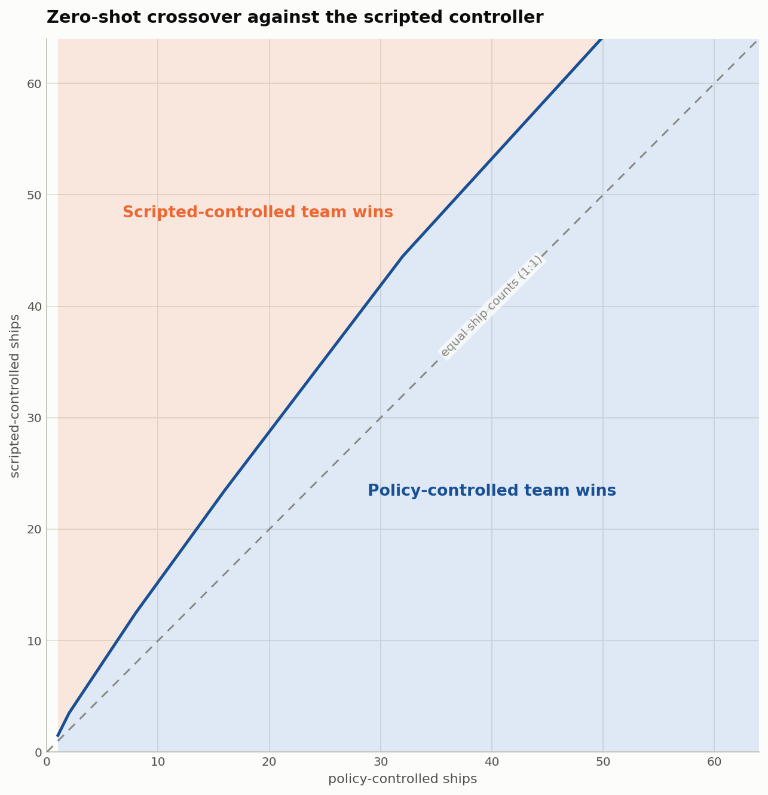

# Boost and Broadside

### Zero-shot fleet coordination from a 4-vs-4 policy


*Outnumbered 11 ships to 8, the learned fleet wins with three ships to spare.*

Boost and Broadside is a tensorized 2D dogfighting environment and reinforcement
learning system built to study coordination at scale. The central question is simple:
can a policy trained with a small team command much larger fleets without retraining?

The reference policy trained exclusively in **4-vs-4** combat, then transferred
zero-shot to fleets of one to 64 ships. A single recurrent network commands the
whole fleet, producing an action for every ship on each forward pass.

[Explore the results](docs/evaluation.md) · [Watch more replays](docs/replays.md) ·
[Understand the architecture](docs/architecture.md) · [Get started](docs/getting-started.md)

## Zero-shot team-size transfer

Ships and obstacles are represented as entity tokens. Spatial attention coordinates the
fleet within each timestep, while per-entity [Griffin-style](https://arxiv.org/abs/2402.19427)
recurrence carries information through time. Because the network operates over a
variable-length token sequence, the same weights can run at fleet sizes never seen
during training.



*From three learned ships onward, the 4-vs-4 policy remains above 50% against a larger
scripted fleet at every scale tested.*

Selected results from the [recorded crossover sweep](docs/crossover/crossover.json):

| Learned ships | Scripted ships | Win rate |
|---:|---:|---:|
| 4 | 5 | **81.6%** |
| 8 | 11 | **69.5%** |
| 16 | 24 | **52.7%** |
| 32 | 47 | **55.9%** |
| 64 | 87 | **53.1%** |

The [evaluation guide](docs/evaluation.md#zero-shot-crossover) covers the search method,
sample sizes, raw artifacts, and limitations behind these measurements.

## Learning progression

A one-billion-step training run completed in 7.5 hours on a single RTX 5090. Post-hoc
calibration places the final checkpoint at about **1826 Elo** on a scale that fixes the
scripted controller at 1000 — a lead of roughly **826 points**, where 400 points
already means ten-to-one odds.


*The calibrated rating keeps rising long after wins against the scripted controller
stop being informative.*

See [results and methodology](docs/evaluation.md#post-hoc-elo-calibration) for the rating
procedure, exact values, and uncertainty.

## Under the hood


One trunk processes the whole fleet as entity tokens — attention mixes across ships
within a timestep, Griffin recurrence carries each ship through time — and every head
emits one output per ship, however many there are.

- The [environment and physics engine](docs/environment.md) runs thousands of tensorized
  battles in parallel, with toroidal movement, projectiles, resources, and orbital
  obstacles. The core simulator lives in
  [`env.py`](src/boost_and_broadside/env/env.py).
- The [policy architecture](docs/architecture.md) combines spatial attention, Griffin
  recurrence, factored action heads, decomposed value estimates, and auxiliary dynamics
  prediction. See
  [`YemongPolicy`](src/boost_and_broadside/models/yemong/policy.py).
- The [training system](docs/training.md) uses recurrent PPO with scripted, self-play,
  running-average, and historical opponents. The update logic is in
  [`ppo.py`](src/boost_and_broadside/train/rl/ppo.py).
- [Evaluation](docs/evaluation.md) and [seeded replays](docs/replays.md) connect aggregate
  measurements with qualitative behavior. The crossover evaluator is
  [`crossover.py`](src/boost_and_broadside/modes/crossover.py).

Headline claims are traceable to code and stored artifacts through the
[evidence map](docs/internal/evidence.md).

## Quick start

Requires [uv](https://docs.astral.sh/uv/) and, for the included reference
checkpoints, Git LFS — training from scratch works without it. After cloning:

```bash
git lfs pull   # fetch reference checkpoints (skip if training from scratch)
uv sync

# Human vs the newest checkpoint (WASD, Shift, Space)
uv run main.py --mode watch

# Small no-W&B training crash test
uv run main.py --mode rl --smoke
```

Training is designed for CUDA hardware; the simulator and test suite also run on CPU.
The [setup and usage guide](docs/getting-started.md) covers checkpoints, training,
evaluation, replay capture, and development checks.

## License

[MIT](LICENSE).
