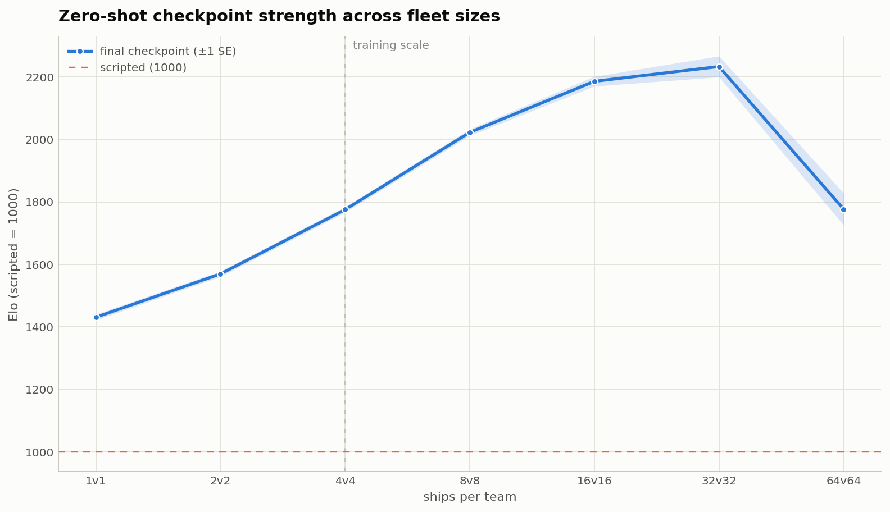

# Boost and Broadside

### Zero-shot fleet coordination from a 4-vs-4 policy


<sub>Replay of <code>resilient-resonance-682</code>, the previous reference run; the
figures below measure <code>good-leaf-719</code>. See <a href="docs/replays.md">replays</a>.</sub>

*Outnumbered 11 ships to 8, the learned fleet wins with three ships to spare.*

Boost and Broadside is a tensorized 2D dogfighting environment and reinforcement
learning system built to study coordination at scale. The central question is simple:
can a policy trained with a small team command much larger fleets without retraining?

The reference policy trained exclusively in **4-vs-4** combat, then transferred
zero-shot to fleets of one to 64 ships. A single recurrent network commands the
whole fleet, producing an action for every ship on each forward pass.

[Explore the results](docs/evaluation.md) · [Watch more replays](docs/replays.md) ·
[Understand the architecture](docs/architecture.md) · [Get started](docs/getting-started.md) ·
[Training runs](docs/training-runs.md)

## Zero-shot team-size transfer

Ships and optional refractive fields are represented as entity tokens. Spatial attention coordinates the
fleet within each timestep, while per-entity [Griffin-style](https://arxiv.org/abs/2402.19427)
recurrence carries information through time. Because the network operates over a
variable-length token sequence, the same weights can run at fleet sizes never seen
during training.



*Rated against the same scripted controller at every size, the 4-vs-4 policy is stronger
the larger the fleet it is given — the coordination it learned scales further than the
setting it learned it in.*

Selected results from the [recorded crossover sweep](checkpoints/good-leaf-719/artifacts/figures/crossover.json),
each row the largest scripted fleet the policy still beats:

| Learned ships | Scripted ships | Win rate |
|---:|---:|---:|
| 4 | 6 | **63.3%** |
| 8 | 12 | **59.8%** |
| 16 | 23 | **64.8%** |
| 32 | 44 | **57.4%** |
| 64 | 79 | **54.4%** |

The [evaluation guide](docs/evaluation.md#zero-shot-crossover) covers the search method,
sample sizes, raw artifacts, and limitations behind these measurements.

## Learning progression

A one-billion-step training run completed in about four days on a single RTX 4070
Laptop. Post-hoc calibration places the final checkpoint at about **1748 Elo** on a
scale that fixes the scripted controller at 1000, a lead of roughly **748 points**,
where 400 points already means ten-to-one odds.


*The calibrated rating keeps rising long after wins against the scripted controller
stop being informative.*

See [results and methodology](docs/evaluation.md#post-hoc-elo-calibration) for the rating
procedure, exact values, and uncertainty.

## Under the hood


One trunk processes the whole fleet as entity tokens, with attention mixing across ships
within a timestep and Griffin recurrence carrying each ship through time. Every head
emits one output per ship, however many there are.

- The [environment and physics engine](docs/environment.md) runs thousands of tensorized
  battles in parallel, with toroidal movement, projectiles, resources, and optional
  static refractive fields that continuously affect both ships and projectiles. The core
  simulator lives in
  [`env.py`](src/boost_and_broadside/env/env.py).
- The [policy architecture](docs/architecture.md) combines spatial attention, Griffin
  recurrence, factored action heads, decomposed value estimates, and auxiliary dynamics
  prediction. See
  [`YemongPolicy`](src/boost_and_broadside/models/yemong/policy.py).
- The [training system](docs/training.md) uses recurrent PPO with scripted, self-play,
  running-average, and historical opponents. The update logic is in
  [`ppo.py`](src/boost_and_broadside/train/rl/ppo.py).
- [Evaluation](docs/evaluation.md) and [seeded replays](docs/replays.md) connect aggregate
  measurements with qualitative behavior. The crossover evaluator is
  [`crossover.py`](src/boost_and_broadside/modes/crossover.py).

Every headline number names the artifact it came from. The figures are linked from
[the reference run's own directory](checkpoints/good-leaf-719/artifacts/figures/), which
records the measurement behind each one.

## Quick start

Requires [uv](https://docs.astral.sh/uv/). Git LFS is only needed for the historical
reference artifacts; those weights predate the current refractive-field observation
schema and are not loadable by this version. After cloning:

```bash
git lfs pull   # fetch reference checkpoints (skip if training from scratch)
uv sync

# Resolve and inspect the RL launch without allocating the trainer
uv run bnb train --profile rl --print-config

# Play a 1v1 match against a null ship in four refractive fields
uv run bnb play

# Human vs a newly trained current-schema checkpoint (WASD, Shift, Space)
uv run bnb watch --team0 null --team1 checkpoints/<run>/<checkpoint>.pt
```

Training is designed for CUDA hardware; the simulator and test suite also run on CPU.
The [setup and usage guide](docs/getting-started.md) covers checkpoints, training,
evaluation, replay capture, and development checks.

## License

[MIT](LICENSE).
