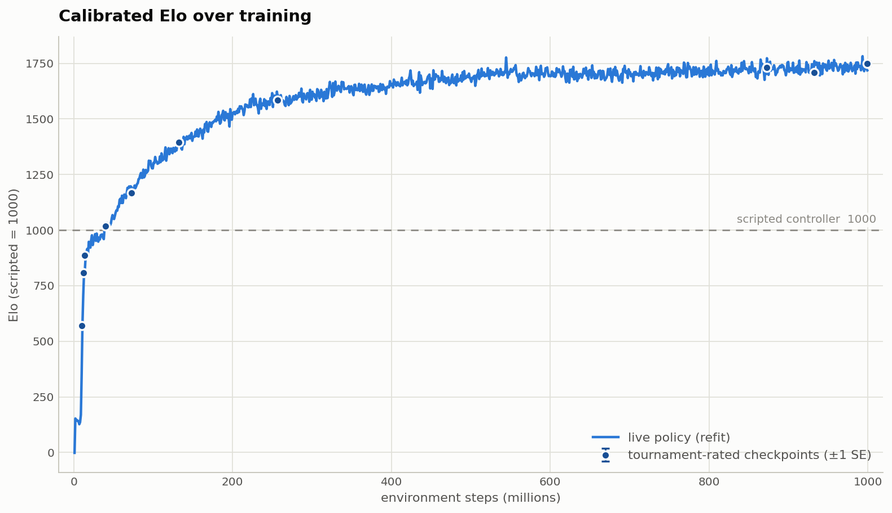
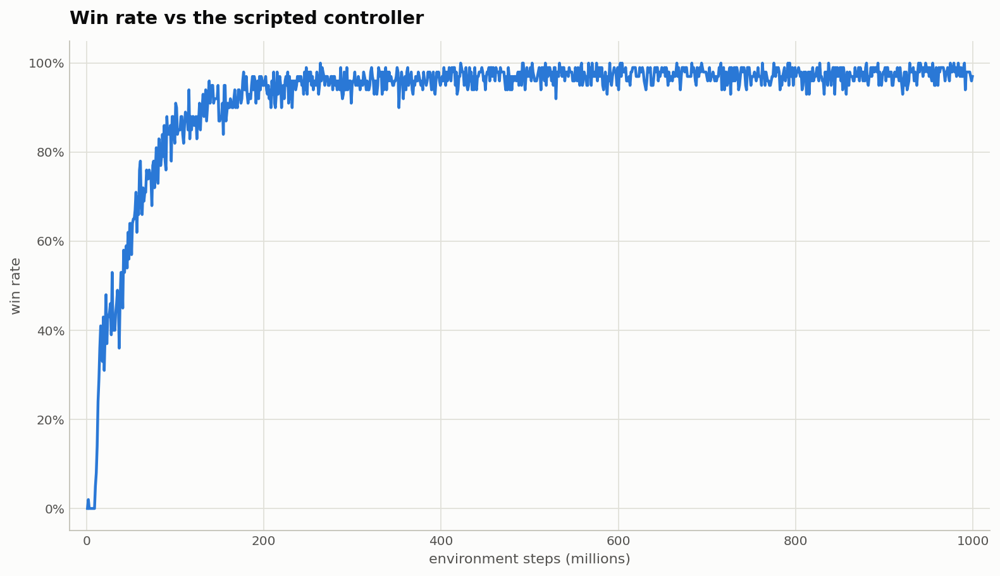
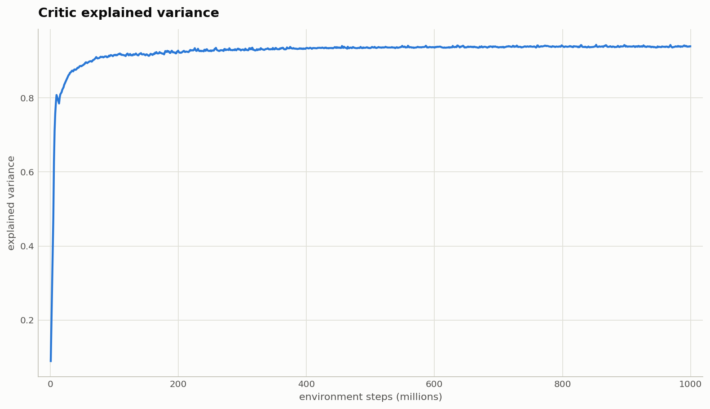
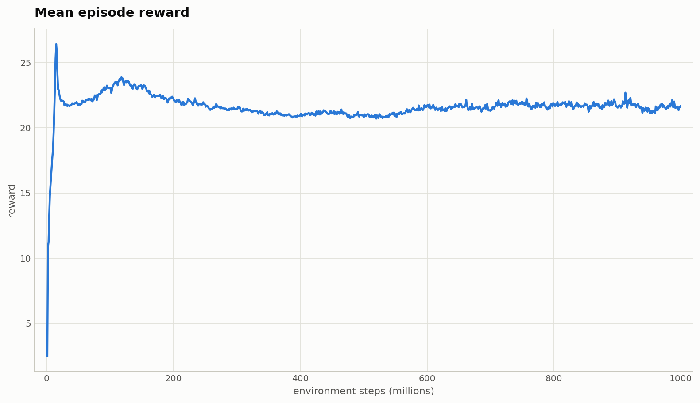
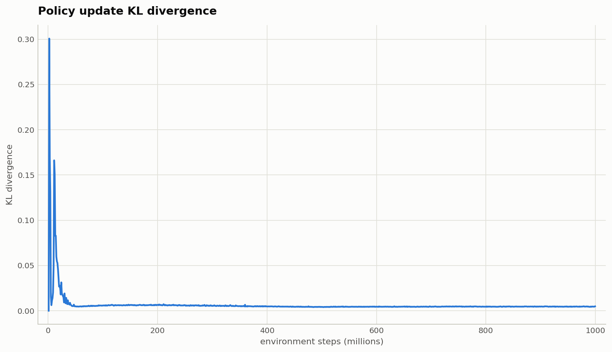
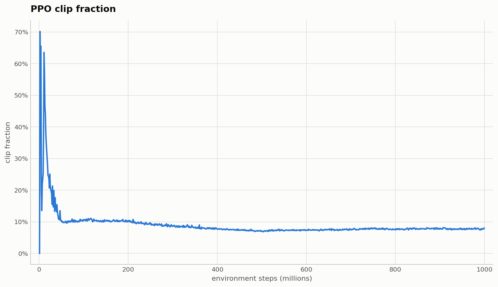
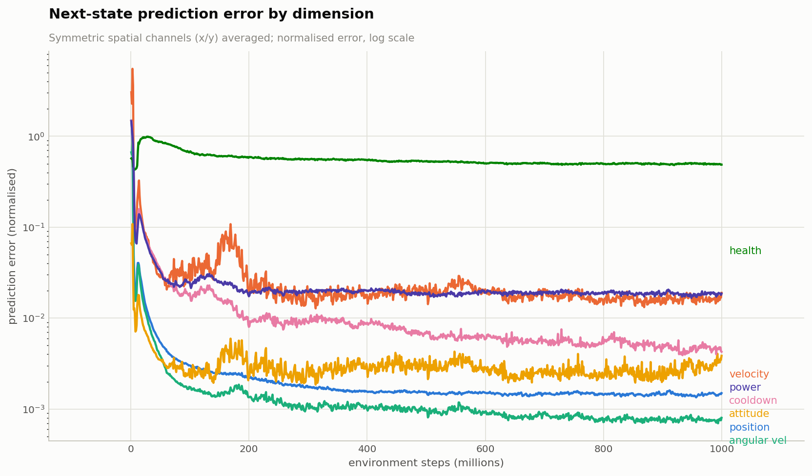

# Boost and Broadside

GPU-accelerated multi-agent RL environment. Teams of ships compete in 2D dogfights on a
toroidal map. Trained with recurrent PPO featuring a decomposed multi-component critic,
ELO-rated league play with continuous in-training evaluation, and a composable
observation/prediction feature pipeline.

## Quick Start

This repo stores landmark-run checkpoints via [git-lfs](https://git-lfs.com). Install it
**once** before cloning so `*.pt` files come down as real weights instead of pointer stubs:

```bash
git lfs install   # then: git clone …  (already-cloned repos: git lfs pull)
```

```bash
uv sync

# RL training from scratch (W&B + checkpoints)
uv run --no-sync main.py --mode rl

# Watch: human (WASD + Shift + Space) vs latest checkpoint
uv run --no-sync main.py --mode watch

# Crash-test a config change without W&B
uv run --no-sync main.py --mode rl --smoke
```

## Modes

| Mode | Description |
|---|---|
| `rl` | PPO training. `--pretrain_from <path.pt>` to warm-start, `--resume` to continue a run. |
| `rl_obstacles` | RL on obstacle avoidance only (no combat; orbiting obstacle fields). |
| `bc` | Behavior-cloning pretraining from the scripted agent (no policy gradient). |
| `bc_warmstart` | BC pretraining (20M steps), then immediately switch to RL in the same process. |
| `watch` | Render live gameplay at 60fps. `--fast-cache` skips the obstacle convergence animation. |
| `collect_stats` | Run parallel matchups and print win-rate statistics. |
| `feature_stats` | Measure label statistics to validate/calibrate feature `label_scale` values. |
| `elo_stats` | ELO tournament across scripted agents and/or run checkpoints. |
| `ar_report` | Autoregressive rollout report for the next-state prediction head. |
| `noise_calibration` | Measure NextStateHead prediction-error statistics. |

Training modes accept `--smoke` for a tiny crash-test run (4 envs, no W&B, exits after a
few updates).

Agent specs for `--team0` / `--team1`: `null` (human keyboard, watch only), `random`,
`latest` (most recent checkpoint), a path to a `.pt` checkpoint, or one of the scripted
agents — `scripted` (stochastic), `scripted_team`, `jouster`, `team_jouster`, `boom_zoom`,
`abreast`, `reverse_turret`, `run_away`, `spiral_evader`, `jinking`.

## Project Structure

```
runs/                       # Hyperparameter profiles (one file per experiment)
  shared.py                 # MODEL_CONFIG, REWARDS, SHIP_CONFIG, per-component GAE params
  rl.py                     # Primary RL run
  rl_obstacles.py           # Obstacle-avoidance-only run
  bc.py / bc_warmstart.py   # Pretraining profiles

src/boost_and_broadside/
  config/
    core.py                 # Frozen dataclasses: ShipConfig, EnvConfig, ModelConfig, RewardConfig
    training.py             # TrainConfig, ScaleConfig, EloEvalConfig, ObstacleCacheConfig
    schedule.py             # Schedule primitives: constant, linear, stepped, exponential, join
  env/
    state.py                # TensorState — GPU-resident state for B parallel envs
    physics.py              # Pure physics (kinematics, shooting, collisions)
    env.py                  # TensorEnv — vectorized physics, no rewards
    observation.py          # MVPObservation dict + TensorState → observation builder
    rewards.py              # Decomposed reward components (one critic head per component)
    wrapper.py              # MVPEnvWrapper — observations, rewards, auto-reset
    obstacle_physics.py     # Harmonic gravity + PBD obstacle dynamics
    obstacle_cache.py       # Pre-converged obstacle map cache
  models/mvp/
    encoder.py              # ShipEncoder — entity tokens from the feature pipeline
    attention.py            # TransformerBlock (MHSA + GatedMLP) with alive masking
    griffin.py              # YemongBlock: TransformerBlock + Griffin RG-LRU temporal block
    policy.py               # MVPPolicy — encoder → YemongBlocks → action/value/aux heads
  agents/                   # Scripted agents (stochastic_scripted, jouster, boom_zoom, ...)
  modes/                    # One module per --mode (agent_factory resolves agent specs)
  train/rl/
    ppo.py                  # PPOTrainer — rollout, GAE, PPO epochs
    features.py             # FeatureCoordinator — observation encoding + aux-prediction spec
    buffer.py               # RolloutBuffer — pre-allocated GAE buffer, return/advantage scalers
    roster.py               # EloRoster — rated league pool with proximity-weighted sampling
    elo_eval.py             # Continuous in-training ELO evaluation
    opponents.py            # Opponent perspectives, league sampling, policy averaging
    checkpoint.py           # Checkpoint serialization, async saves, resume
    logging.py              # Metric assembly + async W&B worker
    sigreg.py               # SIGReg embedding regularizer (config-gated, off by default)
  ui/
    renderer.py             # Pygame renderer reading TensorState directly

tests/                      # pytest suite across env, models, modes, and train
```

## Architecture

### Environment

The entire simulation is tensorized: `TensorState` holds the state of all parallel
environments as GPU tensors, and `TensorEnv` steps physics for every environment at once —
no Python loops over envs or ships. The world is toroidal (positions wrap), teams can be
asymmetric, and optional obstacle fields orbit a per-env gravity center using snapshots
pre-converged by `obstacle_cache.py`. `MVPEnvWrapper` adds observation construction,
per-component rewards, and episode auto-reset.

### Policy (`MVPPolicy`)

A shared trunk processes ships and obstacles as entity tokens; heads apply to ship tokens
only:

```text
obs dict → ShipEncoder → n × YemongBlock → slice [:N] ships
         → ActionHead + NextStateHead + ValueHead (local + TeamPMA win path)
```

- **ShipEncoder**: encodes each entity into a `d_model` token. The `FeatureCoordinator`
  (see Observations) produces a flat encoded vector per entity, which a 2-layer MLP
  (`Linear → RMSNorm → GELU → Linear → RMSNorm`) projects to `d_model`.
- **YemongBlock**: the core backbone, combining spatial and temporal processing:
  - **Spatial (`TransformerBlock`)**: pre-norm transformer — `RMSNorm → MHSA → residual →
    RMSNorm → GatedMLP → residual`. The GatedMLP is SwiGLU-style
    (`down(gelu(gate(x)) × up(x))`). Ships and obstacles attend to each other within a
    timestep; dead entities are masked out as keys.
  - **Temporal (`GriffinTemporalBlock`)**: per-entity recurrence across time using a
    Real-Gated Linear Recurrent Unit (RG-LRU) with learnable decay rates, following the
    Griffin architecture: `norm → (linear₁ → causal_conv → RG-LRU) × GeLU(linear₂) →
    linear_out → residual → GatedMLP(norm) → residual`. The causal depthwise convolution
    keeps a buffer of the last `kernel−1` inputs so step-by-step rollout (T=1) and PPO
    re-evaluation (full rollout) see identical causal context. Update-time re-evaluation
    runs the recurrence as a parallel scan over T.
  - Obstacle tokens participate in attention and carry temporal state but are sliced off
    before the heads.
- **ActionHead**: 2-layer MLP producing factored categorical logits for
  3 power × 7 turn × 2 shoot actions; the joint log-prob is the sum of the three
  sub-action log-probs.
- **NextStateHead**: auxiliary MLP predicting next-state deltas and phase shifts for each
  ship — a dense dynamics-learning signal. The prediction layout is derived from the
  `FeatureCoordinator` (phase deltas for position/attitude/health/power/cooldown, additive
  deltas for velocity, absolute for angular velocity). Phase predictions are applied as
  rotations, so predicted `(sin, cos)` pairs stay on the unit circle by construction.
  Losses: per-step weighted MSE, plus a windowed triangle-convolution loss on
  position/velocity that amplifies systematic drift relative to per-step noise.
- **ValueHead**: per-component critic — one scalar head per active reward component
  (K heads), trained with MSE in a normalized space maintained by `ReturnScaler`
  (per-component EMA of return percentiles, mapping symlog-reward space to roughly
  `[-1, 1]`). The win/loss components are special-cased through **TeamPMA** (pooling by
  multi-head attention): a learned per-team seed attends over that team's alive ships and
  the pooled embedding feeds a dedicated win/loss value head, giving those components
  global team context.

**Hidden state**: `(n_layers, B·(N+M), CONV_KERNEL·D)` — the RG-LRU recurrent state and
the causal-conv buffer packed together, per entity token.

An optional SIGReg regularizer on encoder embeddings exists behind `sigreg_coef`
(0.0 — disabled — in every profile).

### Observations (`FeatureCoordinator`)

The observation pipeline is defined once in `build_standard_coordinator()`
([features.py](src/boost_and_broadside/train/rl/features.py)). Each `Feature` bundles an
accessor (which raw channels to read), an input encoder (network-facing transform), and —
for predicted features — a target encoder plus a `Predictor` defining aux-loss labels.
The encoder input is the concatenation of all encoded features.

| Feature | Input encoding | Dims | Aux prediction |
|---|---|---|---|
| `position_x` / `position_y` | `Fourier(4 freqs, period = world size)` | 8 + 8 | phase delta (toroidal wrap exact) |
| `velocity` | `SymlogVelocity` — direction · symlog(speed) | 2 | additive delta |
| `attitude` | `Fourier(4, 2π)` on (cos θ, sin θ) | 16 | phase delta |
| `angular_velocity` | `Symlog` | 1 | absolute |
| `health` / `power` / `cooldown` | `UnitCircle` — quarter-wave (sin, cos) | 2 each | phase delta |
| `team_id` | `OneHot(3)` (team 0 / team 1 / obstacle) | 3 | — |
| `alive` | identity | 1 | — |
| `prev_power` / `prev_turn` / `prev_shoot` | `OneHot(3/7/2)` | 3 + 7 + 2 | — |
| `radius` | `Normalize` | 1 | — |

Every predicted feature has a `label_scale` (≈ 1/std of raw labels) so the network
predicts O(1) values; `feature_stats` and `noise_calibration` modes exist to validate and
recalibrate these.

### Rewards (decomposed critic)

Rewards are decomposed into independent components (see `REWARD_COMPONENT_NAMES` in
[rewards.py](src/boost_and_broadside/env/rewards.py)), each with its own critic head and
per-component GAE `γ`/`λ` (long horizons for win/loss, short for dense shaping — see
`runs/shared.py`). Components always score events from the ship's own perspective;
team accounting happens at PPO update time through a **lambda aggregation matrix**, not by
negating rewards:

- **Win components** (`ally_win`, `enemy_win`) — team-aggregated; `enemy_win` carries
  λ = −1 for enemies, restoring zero-sum outcome credit while letting the critic
  distinguish win / draw / loss.
- **Global outcome components** (`ally_damage`, `enemy_damage`, `ally_death`,
  `enemy_death`) — aggregated across the team via lambda.
- **Local components** (diagonal lambda, self-only): dense shaping (`facing`,
  `closing_speed`, `shoot_quality`), kill credit (`kill_shot`, `kill_assist`), per-ship
  combat accounting (`damage_taken`, `damage_dealt_enemy`, `damage_dealt_ally`, `death`),
  obstacle avoidance (`obstacle_death`, `obstacle_proximity`, `obstacle_closing_speed`,
  `obstacle_tti`), and behavior shaping (`shooting_penalty`, `speed`).

Each component belongs to a schedule group (`true_reward_scale` / `global_scale` /
`local_scale`) whose time-varying multiplier scales its configured weight, so whole reward
groups can be faded in or out over training.

### League play & ELO evaluation

`EloRoster` maintains a pool of rated opponents: a fixed random anchor (ELO 0), the
running-average policy, the scripted agent, and past checkpoints added at ELO milestones
(weakest evicted beyond capacity). League opponents are sampled by ELO proximity
(`exp(−|elo_i − training_elo| / temperature)`), and the opponent mix per rollout
(scripted / avg-model / league fractions) is schedule-driven.

Evaluation runs continuously during training on dedicated eval environments stepping
three matchups in parallel — live vs anchor, live vs average, and average vs anchor —
where the anchor for each env is the random or scripted agent, chosen in proportion to
the information that matchup provides about the current rating. ELO updates run on-GPU
off the win/loss results; the resulting rating also gates schedule features (BC-loss
decay, avg-model accumulation, tighter KL threshold at high ELO).

## Results

Figures below are for the current landmark run, `resilient-resonance-682` — a
1B-environment-step run. They are rendered by `scripts/render_charts.py` from a single
W&B-export-format source (`checkpoints/<run>/wandb_export/` for the in-training history,
`checkpoints/<run>/elo_calibration/` for the post-hoc calibrated ELO), so both curves are
read and drawn by the same code. Re-render any time with:

```bash
uv run --no-sync scripts/render_charts.py            # -> docs/results/*.png
```

### Skill over training

The headline is ELO against a fixed random anchor. The **calibrated** curve is each
update's live policy re-rated post-hoc against opponents whose ratings a full tournament
has pinned down (`--mode elo_calibrate`), which recovers what the policy was actually
worth free of the in-training rating filter's drift — it clears the scripted agent by
~800 ELO and lands well above the in-training estimate. Points are the frozen ladder
checkpoints; the dashed rule is the scripted agent, the one opponent shared across runs.



Win rate against the scripted agent saturates near 100% within the first ~200M steps,
long before the ELO curve stops climbing — evidence that most of the run's improvement is
self-play beyond anything the scripted opponent can measure.



### Training health

The critic's aggregate explained variance, the mean episode reward, and the PPO
diagnostics (update KL and clip fraction) over the run:






### Next-state prediction

The auxiliary next-state head's normalised prediction error per state dimension (symmetric
x/y channels averaged), on a log scale. Most dimensions fall two to three orders of
magnitude as the model learns the dynamics; `health` stays high, as damage events are
sparse and hard to anticipate step-to-step.



## Configuration

All hyperparameters live in `runs/`. Shared constants (`MODEL_CONFIG`, `REWARDS`,
`SHIP_CONFIG`, per-component GAE tables) are in `runs/shared.py`; each profile imports
them and overrides only what differs. Configs are frozen dataclasses — no config
framework.

Time-varying parameters (learning rate, loss coefficients, opponent fractions, group
scales) are expressed as composable schedules over the global step:

```python
learning_rate = join(
    (0, linear((0, 1e-7), (5_000_000, 3e-4))),                        # warmup
    (5_000_000, constant(3e-4)),                                      # cruise
    (100_000_000, exponential((100_000_000, 3e-4), (500_000_000, 1e-4))),  # decay
)
scripted_fraction = stepped((0, 0.5), (50_000_000, 0.3))
```

A `TrainConfig` can also carry multiple `ScaleConfig`s — environment sizes trained
simultaneously with gradients accumulated across scales; the primary scale hosts
opponents, additional scales run pure self-play.

## Checkpoints

Saved to `checkpoints/<run-name>/` on a scheduled interval: rolling `step_<N>.pt` files
(full training state: policy, optimizer, scalers, average policy, ELO state — everything
`--resume` needs), `recent_avg.pt` (the average policy), and best-model snapshots. ELO
milestone checkpoints are registered in the league roster, with roster metadata persisted
alongside as JSON. Saves run asynchronously off the training loop.

Working runs are gitignored. **Landmark runs** — baselines that future work forks from — are
kept in-repo: un-ignored in `.gitignore`, `.pt` files tracked by git-lfs, plus a
`wandb_export/` archive (config, summary, sampled metric history, run files) produced by
`scripts/export_wandb_run.py`. The current baseline is `resilient-resonance-682`.

## Logging

W&B logging runs in a background thread, off the GPU hot path. All configs (model,
rewards, resolved schedule snapshots) are serialized into the W&B run config. Disabled
under `--smoke`.

## Development

```bash
uv run --no-sync pytest -q          # full test suite
uv run --no-sync pytest -x -q       # stop on first failure
uv run --no-sync ruff check .       # lint
```

See [STYLE_GUIDE.md](STYLE_GUIDE.md) for code conventions.
