# Autoregressive Rollout Report

This report compares the ground truth simulation with closed-loop (forced actions) and open-loop (imagined actions) autoregressive rollouts.

## 2D Trajectory Map (All Ships)
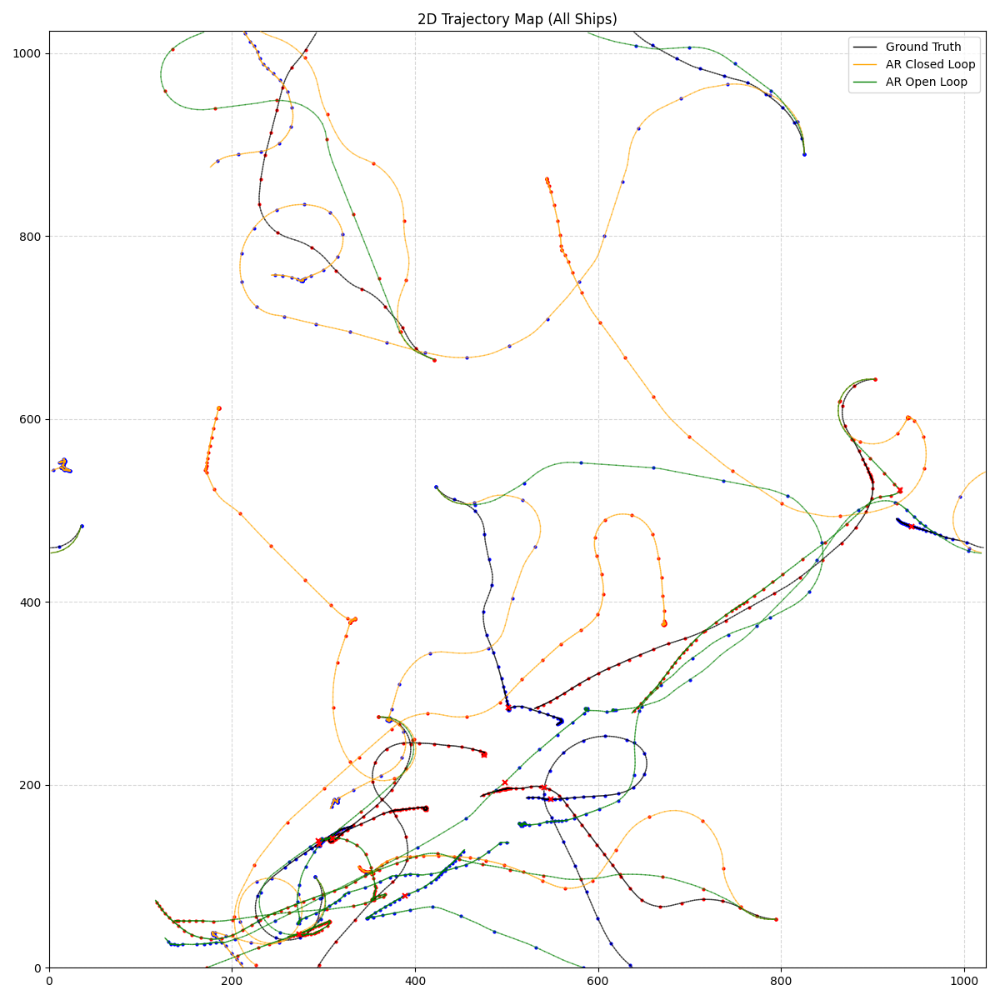

## 2D Trajectory Map (Featured Ships, Centered)
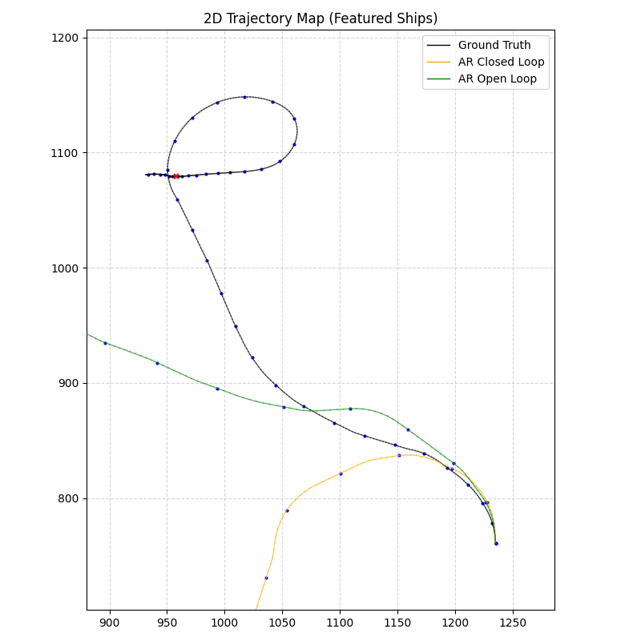

## 2D Velocity Space Map
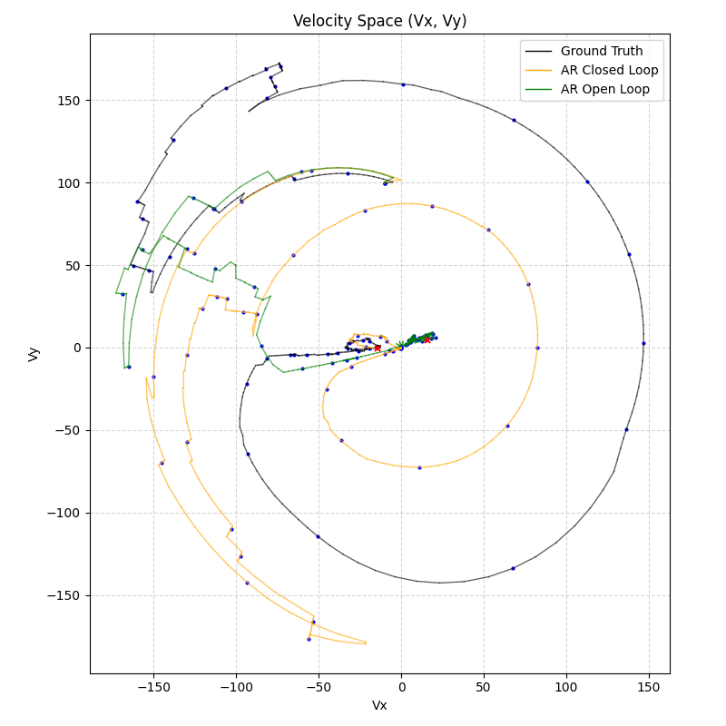

## Error Metrics Over Time
Calculated only while both the ground truth and rollout ships are alive.

### Position Error (Toroidal L2)
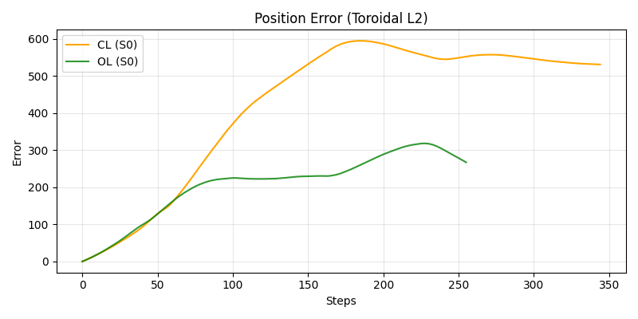

### Velocity Error (L2)
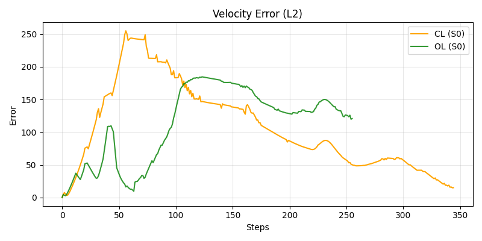

### Pos+Vel 4D Error (L2)
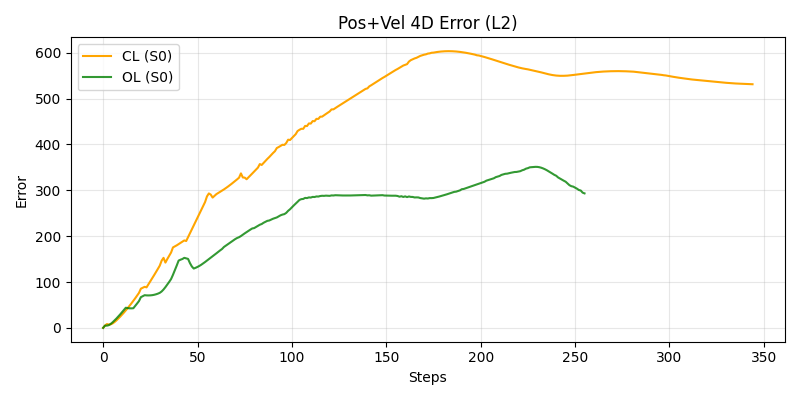

### Attitude Error (MAE)
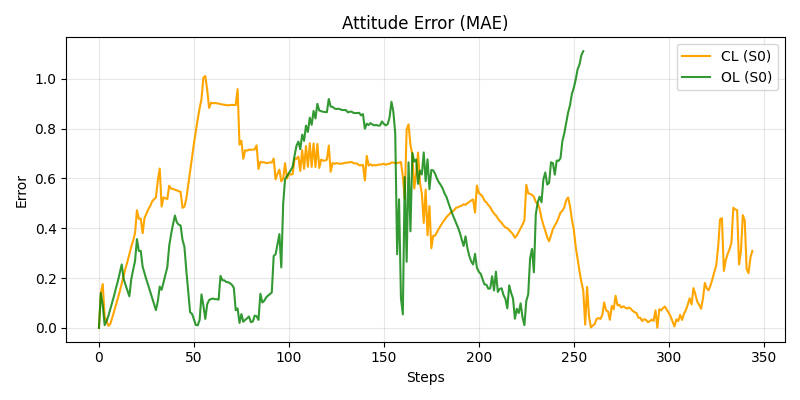

### Health Error (MAE)
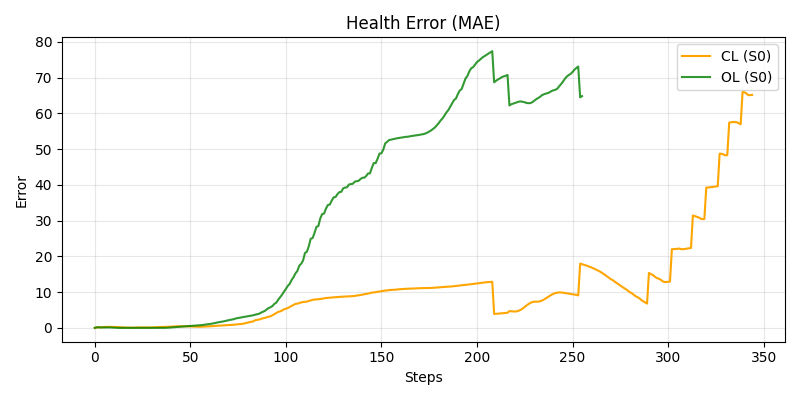

### Power Error (MAE)
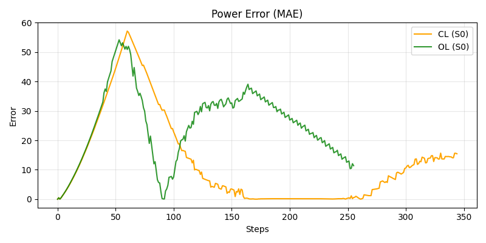

## Feature Divergence
### Position X
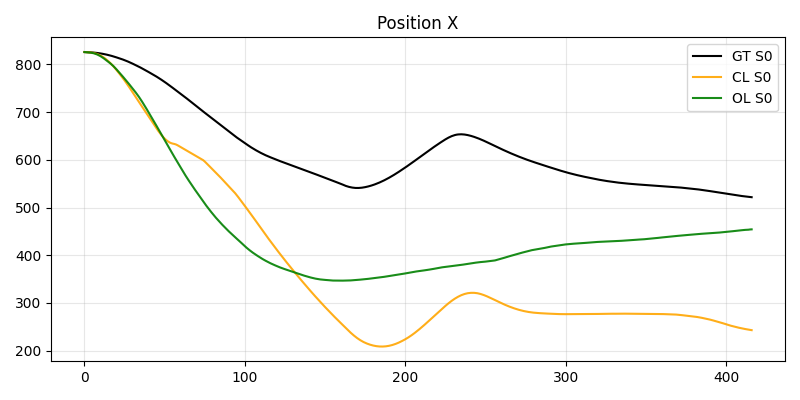

### Velocity X
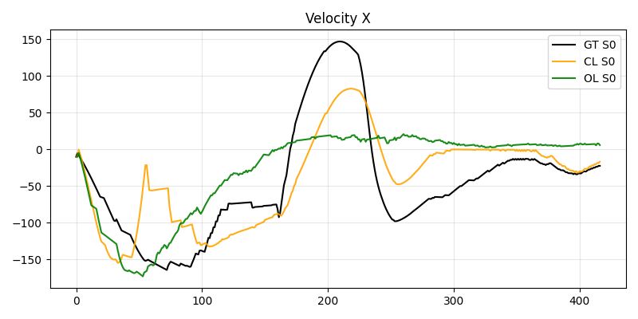

### Angle (cos)
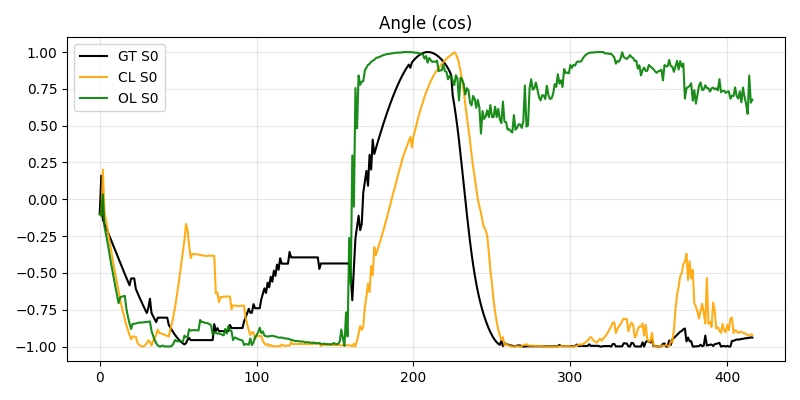

### Angular Vel
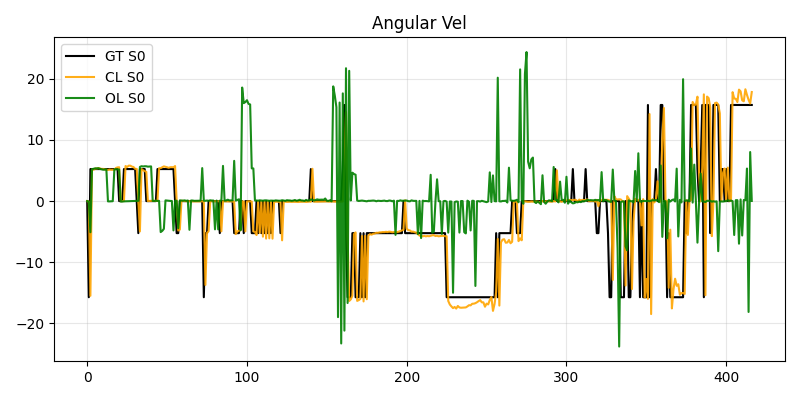

### Angular Vel (Scaled to GT)
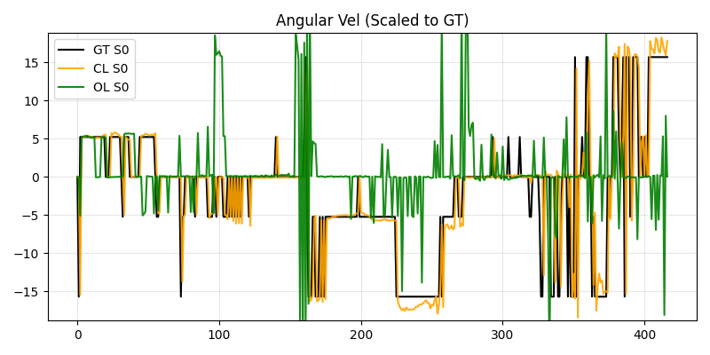

### Health
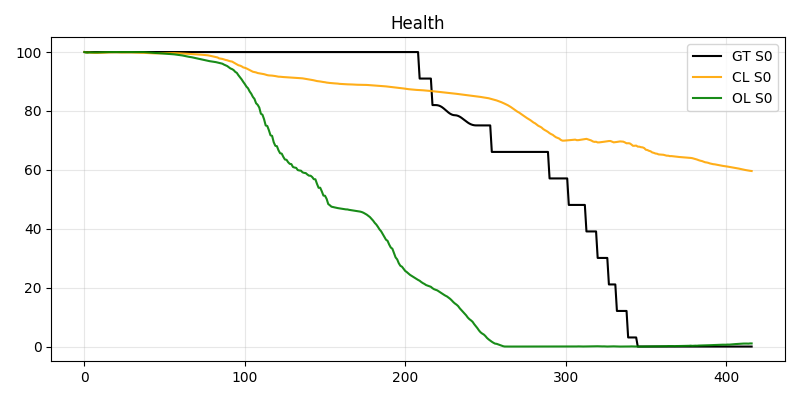

### Power
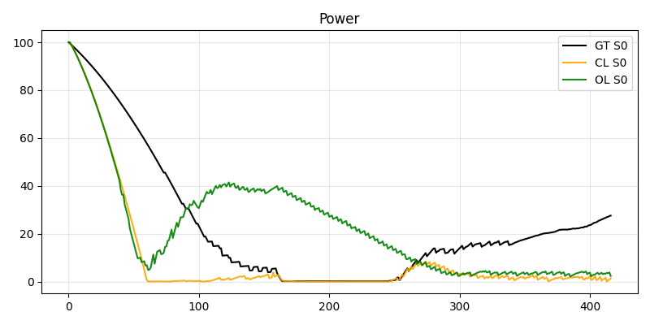

### Cooldown
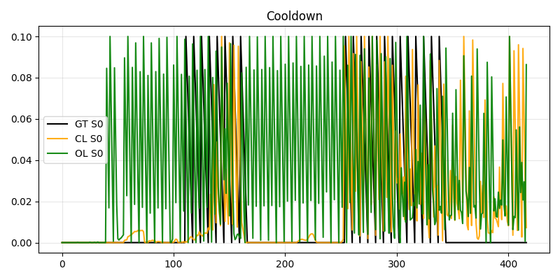

### Alive Prob
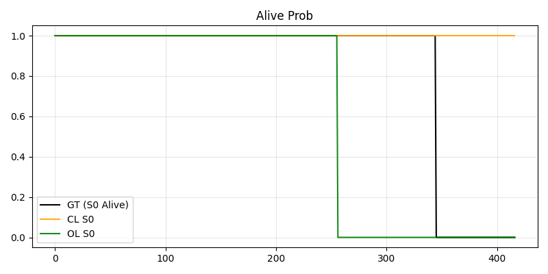
