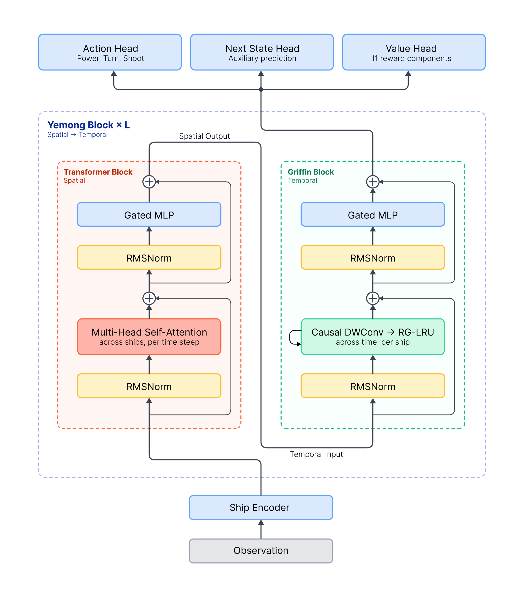

# Policy architecture

`YemongPolicy` is a centralized recurrent controller. It reads the full scene, exchanges
information across entities with spatial attention, carries per-entity memory through
time, and emits a factored action for every ship in the learned fleet. Its name (*Yemong*,
from the Korean 예몽, a dream that foretells the future) comes from the auxiliary
objective that makes it forecast the world several decisions ahead. Zero-shot transfer across team sizes comes
from its variable-cardinality design, described [below](#why-team-size-can-change).



The diagram shows the reference-run configuration; component counts are set by
[`ModelConfig`](../src/boost_and_broadside/config/core.py), not fixed properties of the
architecture.

## Data flow

```text
global tensor state
    ↓
ship + refractive-field entity tokens          bullets (N·K)
    ↓                                              ↓
FeatureCoordinator → encoder MLP            bullet encoder
    ↓                                              ↓
[spatial Transformer ×S  ← cross-attends ──────────┘
 → temporal Griffin/RG-LRU ×T] × blocks
    ↓
ship tokens only
    ├── factored action distributions (per ship)
    ├── decomposed value estimates (per ship/component)
    └── predictive belief state (per ship) → state and action predictions per horizon
```

For a batch `B`, `N` ships, `M` fields, and embedding width `D`, the shared trunk works
on `(B, N+M, D)` entity tokens. Fields participate in attention but not in recurrence;
bullets are key/value-only inputs to cross-attention and are never entity tokens at all.
The three output heads slice the first `N` ship tokens.

## Block structure

Every Yemong block has the same shape, set by [`ModelConfig`](../src/boost_and_broadside/config/core.py):
`n_spatial_per_block` spatial sublayers followed by `n_temporal_per_block` temporal ones,
repeated `n_yemong_blocks` times. The reference configuration is two blocks of
`2 spatial + 1 temporal`, so the trunk is `S S T | S S T`.

The ratio is deliberate. At these token counts a spatial sublayer costs roughly a quarter
of a temporal one at equal parameter count, so relational depth is the cheap axis to spend
on.

Four spatial layers is more depth than the reasoning appears to need. *"Fight the enemy
that is not already swarmed"* is two hops: one layer for each ship to aggregate its own
local situation, one for the decision. The tighter limit is head count, which sets how
many distinct aggregates a single layer can hold at once.

`n_bullet_cross_per_block` spatial sublayers cross-attend to bullets, counted from the
first. The front is where they have to go. A bullet read must precede at least one more
entity-to-entity layer; otherwise a ship can react to fire aimed at itself but can never
reason about fire aimed at an ally it might support.

## Observation and feature coordination

[`observation_from_state`](../src/boost_and_broadside/env/observation.py) exposes global
position, velocity, attitude, angular velocity, health, power, cooldown, team identity,
alive state, radius, previous action, ship-local encoded log index, and the local
refractive-index gradient. Fields are appended as always-alive entity tokens with team ID
2, zero motion/action channels, and numeric physical features: transition width, absolute
inside and parent/outside log index, log index ratio, and normalized interface damage.
Field properties are unchanged by team flipping.

The index gradient is the force term in `a = F/m + 0.5|v|² grad(log m) - (v·grad(log m))v`.
Without it a ship can see which medium it occupies but not which way that medium is
changing. It would feel the resulting acceleration with nothing in its input to explain
it.

The policy does not hand-encode those channels. The canonical
[`FeatureCoordinator`](../src/boost_and_broadside/train/rl/features.py) binds each raw
channel to:

1. an accessor from the observation dictionary;
2. a network-facing input transform;
3. where applicable, a target transform and predictor for the predictive state loss.

| Feature | Network encoding | Auxiliary target |
|---|---|---|
| position x/y | four-frequency Fourier features over the toroidal period | phase delta |
| velocity | direction scaled by [symlog](https://arxiv.org/abs/2301.04104) speed | additive velocity delta |
| attitude | four-frequency Fourier features | phase delta |
| angular velocity | symlog scalar | next absolute value |
| health, power, cooldown | circular bounded encoding | phase delta |
| team identity | three-way one-hot | none |
| alive state | scalar | none |
| previous power/turn/shoot | categorical one-hot | none |
| radius | shared ship/field scalar divided by half the shorter world dimension | none |
| field width | normalized scalar | none |
| field inside/outside log index and ratio | normalized physical scalars | none |
| interface damage | normalized scalar | none |
| ship-local log index | `log(n)/(2 log(s))` | additive next-step delta |
| ship-local index gradient | normalized `grad(n)` pair | none |

Phase targets make wraparound natural: crossing the map boundary is a small rotation, not
a large coordinate jump. Feature dimensions and prediction layout are derived from the
registered features rather than hardcoded in model code.

The index gradient is an input only. Given the static field map it is a deterministic
function of position. Making it a target would also mean inventing a `label_scale`, since
those are `1/std` estimates and there is nothing here to estimate one from. A mis-set
scale can quietly dominate or vanish inside the aux loss, so it stays out until
measured.

Bullets have their own feature set on a separate axis, built by `build_bullet_coordinator`:

| Bullet feature | Network encoding |
|---|---|
| position x/y | four-frequency Fourier, **identical basis to ships** |
| velocity | direction scaled by symlog speed, as for ships |
| remaining damage, remaining lifetime | normalized scalars |
| local log index, local index gradient | normalized physical scalars |
| shooter team | two-way one-hot, never a per-ship index |
| active | key-padding mask, not a feature |

Both pipelines are derived from `ShipConfig` by
[`policy_io.build_policy`](../src/boost_and_broadside/train/rl/policy_io.py), the single
path that constructs a policy. Which encoders exist therefore follows from the config,
not from what a call site passes. The bullet encoder exists exactly when
`n_bullet_cross_per_block > 0`.

## Entity encoder

[`ShipEncoder`](../src/boost_and_broadside/models/yemong/encoder.py) concatenates the
encoded features and projects each entity independently into `d_model` with a two-layer
MLP and RMS normalization. Team and alive information remain part of the token; alive
masks are also passed to attention so dead entities cannot act as keys.

Setting `encoder_split` gives ships and fields a separate first projection over shared
plus own channels, followed by a *shared* second projection. Each feature declares a
`FeatureScope`, so a field token no longer spends most of its input width on ship-only
channels that are hard zeros for it. The shared output layer keeps both token types in one
latent space. Spatial layers apply a single `W_qkv` to ships and fields alike, and cannot
reconcile two spaces that have drifted apart.

[`BulletEncoder`](../src/boost_and_broadside/models/yemong/encoder.py) is separate and
deliberately narrow. It runs over `N·K` entities where the entity encoder runs over `N+M`,
so its width is what sets encoder cost. A bullet is also a much simpler entity to
describe.

The reference policy uses `d_model=128` and four attention heads.

## Spatial attention

Within each timestep, [`TransformerBlock`](../src/boost_and_broadside/models/yemong/attention.py)
applies pre-normalized multi-head self-attention and a gated MLP with residual connections.
Every live ship can therefore condition its action on every other live ship and field.

## Bullet cross-attention

Bullets are observed directly rather than inferred. Refractive fields make inference
impractical: a bullet curves under `grad(n)`, refracts, can totally internally reflect,
travels at `500/n` locally, and loses damage crossing interfaces, so dead-reckoning one
from the shooter's pose amounts to integrating an ODE inside the recurrent state.

They enter as **key/value-only** tokens: no query, no output projection, no FFN, no
recurrence. A bullet therefore costs `2·D²` per token against `16·D²` for a full entity,
cheap enough to attend over all of them instead of selecting a top-k. Nothing persists
between steps either, so a recycled ring-buffer slot cannot carry stale state.

Bullet position and velocity use the *same* encodings as ships. Attention computes relative
geometry as a bilinear form over Fourier features, and `q·k` reduces to a function of the
displacement only when both sides expand on one shared frequency basis; mismatched
frequencies leave cross terms that never form relative geometry at all. Shooter identity is
carried as a team one-hot and never as an index over ships, which would fix `N` in the
weights and break zero-shot transfer.

Softmax normalises, so this read conveys *which* bullets are relevant but not *how many*.
Threat intensity is not yet available. The transfer-safe fix is an environment-side
saturating count and a lethality ratio; sum-pooling would grow without bound as fleets
scale.

## Temporal recurrence

After spatial mixing, [`GriffinTemporalBlock`](../src/boost_and_broadside/models/yemong/griffin.py)
updates each ship through a causal depthwise convolution and real-gated linear recurrent
unit, following [Griffin](https://arxiv.org/abs/2402.19427) (De et al., 2024), followed by
a gated MLP. Each ship carries its own temporal state, while attention supplies current
cross-entity context.

Only ships are recurrent. A field is static within an episode, so a recurrence over it
converges to a fixed point and carries nothing the encoder did not already supply, while
costing the expensive half of every block. Field tokens instead take
`forward_nonrecurrent`, which replaces the causal conv and RG-LRU with a per-sublayer
linear and keeps `norm1`, `linear1`, `linear2`, `linear_out`, `norm2`, and `gated_mlp`
shared with the ship path. Running both types through the same weights leaves the next
spatial layer's single `W_qkv` no divergence to undo. The substitute linear supplies the
one thing shared weights cannot: a type-specific linear map. It is initialised to the
identity, because `b1_out` feeds a multiplicative gate and zeroing it would erase the
branch entirely.

The recurrent state therefore covers ships only, `(n_yemong_blocks · n_temporal_per_block,
B·N, CONV_KERNEL·D)`, a third smaller than in the four-field profile before.

The implementation supports both execution patterns required by recurrent PPO:

- step-by-step rollout, where the recurrent state is updated once per environment step;
- full-sequence re-evaluation during PPO updates, where the same causal computation runs
  over the stored rollout.

Tests in [`tests/models/test_encoder.py`](../tests/models/test_encoder.py) pin recurrent
equivalence, attention masking, dtype behavior, and gradient checkpointing.

## Per-ship action head

The action head emits 12 logits for each ship and splits them into categorical power,
turn, and shoot distributions with sizes 3, 7, and 2. Actions and entropy remain factored;
the joint log probability is the sum of the three selected sub-action log probabilities.

The output shape is `(B, N, 3)` action indices.

## Decomposed value head

The critic produces one value per ship and active reward component. Most components use a
local token projection. Win/loss components use TeamPMA, which pools by multi-head
attention in the style of the [Set Transformer](https://arxiv.org/abs/1810.00825)
(Lee et al., 2019): learned seeds attend over the live ships of each team and feed a
dedicated outcome-value projection. That gives global outcome targets an explicitly
pooled team representation while retaining per-ship critic outputs.

Returns are normalized per component by the training system before value loss. Reward
semantics, aggregation, and horizons are documented in [training](training.md#reward-decomposition).

## Predictive belief state

The auxiliary objective is a belief about the future, rolled forward from the trunk's
final per-ship latent by [`predictive.py`](../src/boost_and_broadside/models/yemong/predictive.py):

```text
post-Yemong ship latent
    ↓  predictive projection            (Linear → RMSNorm, no hidden layer)
predictive latent, horizon 0 ──→ state prediction: t → t+1
    │                       └──→ action prediction: the decision made at t
    ↓  predictive transition            (residual MLP → RMSNorm)
predictive latent, horizon 1 ──→ state prediction: t+1 → t+2
    │                       └──→ action prediction: the decision made at t+1
    ↓  the same transition again
   ...
```

There is exactly one projection, one transition, and one head of each kind; the
transition and both heads are reused at every horizon, so depth costs no parameters and
a horizon-11 belief obeys the dynamics a horizon-1 belief obeys.

**The rollout is open-loop.** Nothing after the projection reads an observation, a latent,
or an action from the future. Rollout states and actions are targets and only targets,
which is what leaves the later horizons genuinely uncertain — the point of the objective
rather than an omission from it. This is deliberately *not* an action-conditioned world
model: if an opponent has several plausible next moves, the action head is supposed to say
so in its distribution.

**Two families of target, both local to the horizon.** The state head predicts the
coordinator's registered target channels — position and attitude phase deltas, velocity
deltas, resource phase deltas, absolute angular velocity, ship-local log-index delta —
for the transition *out of the step the belief describes*, never a cumulative displacement
from the observed step. That keeps the well-grounded immediate physics as an anchor while
making every later horizon forecast a transition whose inputs it cannot see. The action
head predicts the same factored `[power | turn | shoot]` categoricals the actor emits,
trained by cross-entropy against the decision actually taken, and shares no weight with
the actor. Each factor is normalized by its own maximum entropy so the widest one does not
take the loss by cardinality alone — see
[the predictive objective](training.md#the-predictive-auxiliary-objective).

Static field material channels remain inputs, not prediction targets; the local index
target is what makes entering and leaving a medium visible to the learned dynamics.

Acting decodes none of this. Choosing an action needs the trunk and the actor head, and a
single step could only ever produce horizon 0 anyway, so `get_action_and_value` returns a
state prediction only when asked — which the rollout, the league opponents, and the rated
evaluation games never do. The modes that *display* or *measure* a prediction (imagined
trajectories, the AR report, noise calibration) request it explicitly.

Why the horizon has to be more than one step is a property of the observation, not of the
architecture — see [action timing](training.md#action-timing). The loss, its masking, and
its diagnostics are described under
[PPO and auxiliary losses](training.md#ppo-and-auxiliary-losses).

The immediate channel errors are shown in [evaluation](evaluation.md#auxiliary-dynamics-learning),
with deeper autoregressive diagnostics under [`docs/ar_report/`](../checkpoints/good-leaf-719/artifacts/figures/ar_report_4v4/) and noise
analysis under [`docs/noise_calibration/`](../checkpoints/good-leaf-719/artifacts/figures/noise_calibration/).
Those figures were measured on run 719, whose auxiliary head was the single one-step
predictor this replaced.

## Why team size can change

No learned weight matrix has a ship-count dimension. Attention and recurrence operate
over the current token axis, and the heads apply to however many ship tokens are present.
That makes new team sizes executable without retraining; the
[crossover sweep](evaluation.md#zero-shot-crossover) tests whether the learned behavior
remains effective as the fleet grows.

The bullet path preserves this. Cross-attention is linear in bullet count, and shooter
identity is a team one-hot with no per-ship index anywhere. Softmax attention yields
proportions, which is the invariant that survives a change in fleet size: "outnumbered two
to one" means the same thing at any scale, while "five enemies nearby" does not.
