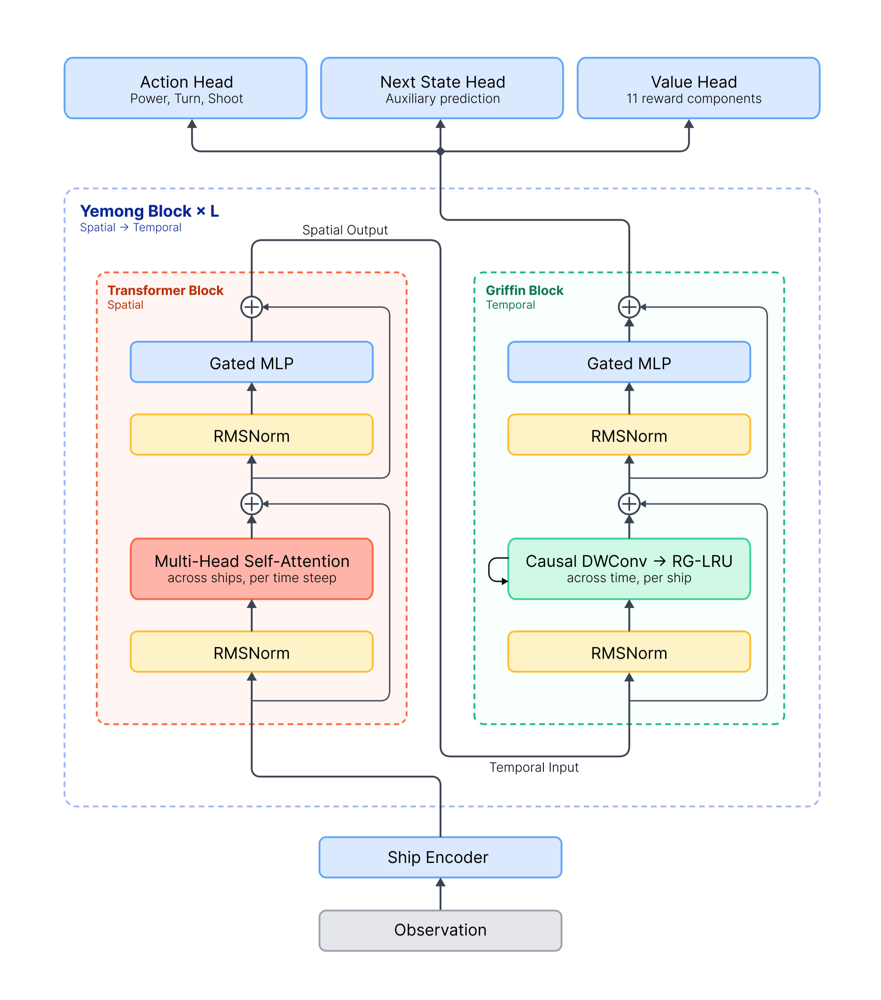

# Policy architecture

`YemongPolicy` is a centralized recurrent controller. It reads the full scene, exchanges
information across entities with spatial attention, carries per-entity memory through
time, and emits a joint physical command for every ship in the learned fleet. Its name (*Yemong*,
from the Korean 예몽, a dream that foretells the future) comes from the auxiliary head that
learns to predict the next state of the world. Zero-shot transfer across team sizes comes
from its variable-cardinality design, described [below](#why-team-size-can-change).



The diagram shows the reference-run configuration; component counts are set by
[`ModelConfig`](../src/boost_and_broadside/config/core.py), not fixed properties of the
architecture.

## Data flow

```text
global tensor state
    ↓
ship + refractive-field entity tokens          bullets (N·K)
    ↓                                              ↓
FeatureCoordinator → encoder MLP            bullet encoder
    ↓                                              ↓
[spatial Transformer ×S  ← cross-attends ──────────┘
 → temporal Griffin/RG-LRU ×T] × blocks
    ↓
ship tokens only
    ├── joint 42-command action distribution (per ship)
    ├── decomposed value estimates (per ship/component)
    └── next-state predictions (per ship)
```

For a batch `B`, `N` ships, `M` fields, and embedding width `D`, the shared trunk works
on `(B, N+M, D)` entity tokens. Fields participate in attention but not in recurrence;
bullets are key/value-only inputs to cross-attention and are never entity tokens at all.
The three output heads slice the first `N` ship tokens.

## Block structure

Every Yemong block has the same shape, set by [`ModelConfig`](../src/boost_and_broadside/config/core.py):
`n_spatial_per_block` spatial sublayers followed by `n_temporal_per_block` temporal ones,
repeated `n_yemong_blocks` times. The reference configuration is two blocks of
`2 spatial + 1 temporal`, so the trunk is `S S T | S S T`.

The ratio is deliberate. At these token counts a spatial sublayer costs roughly a quarter
of a temporal one at equal parameter count, so relational depth is the cheap axis to spend
on.

Four spatial layers is more depth than the reasoning appears to need. *"Fight the enemy
that is not already swarmed"* is two hops: one layer for each ship to aggregate its own
local situation, one for the decision. The tighter limit is head count, which sets how
many distinct aggregates a single layer can hold at once.

`n_bullet_cross_per_block` spatial sublayers cross-attend to bullets, counted from the
first. The front is where they have to go. A bullet read must precede at least one more
entity-to-entity layer; otherwise a ship can react to fire aimed at itself but can never
reason about fire aimed at an ally it might support.

## Observation and feature coordination

[`observation_from_state`](../src/boost_and_broadside/env/observation.py) exposes global
position, velocity, attitude, angular velocity, shield/health, power, cooldown, shield
recharge delay, team identity, alive state, radius, pending action, ship-local encoded
log index, and the local
refractive-index gradient. Fields are appended as always-alive entity tokens with team ID
2, zero motion/action channels, and numeric physical features: transition width, absolute
target log index.
Field properties are unchanged by team flipping.

The index gradient is the force term in `a = F/m + 0.5|v|² grad(log m) - (v·grad(log m))v`.
Without it a ship can see which medium it occupies but not which way that medium is
changing. It would feel the resulting acceleration with nothing in its input to explain
it.

The policy does not hand-encode those channels. The canonical
[`FeatureCoordinator`](../src/boost_and_broadside/train/rl/features.py) binds each raw
channel to:

1. an accessor from the observation dictionary;
2. a network-facing input transform.

| Feature | Network encoding |
|---|---|
| position x/y | 9-level nested code, 9 colours per level (81) |
| velocity | three projections of log-compressed velocity, 81 bins each (243) |
| attitude | 4-level nested circular code, 4 colours per level (16) |
| angular velocity | 41 bins over ±610°/s |
| shield delay, health, power, ship-local log index | 21 bins each |
| cooldown | 4 bins, one per tick |
| team identity | three-way one-hot |
| alive state | scalar |
| currently visible | scalar |
| belief token valid | scalar, attention and composition |
| time since observation | symlog scalar |
| pending joint command | 42-way probability vector |
| radius | shared ship/field scalar divided by half the shorter world dimension |
| field width | normalized scalar |
| field target log index | normalized physical scalar |
| ship-local index gradient | normalized `grad(n)` pair |
| ally / enemy presence | two `log1p` Gaussian aggregates, optional |

The first six rows are one categorical code per ship, 469 wide
([`ship_codes.py`](../src/boost_and_broadside/train/rl/ship_codes.py)), and they are also
what [the next-state head](#auxiliary-next-state-head) predicts. Each is a set of softmax
groups: a two-hot (or, for position, a bilinear four-hot) for a ship in sight, smoothed by
the belief's spread for one out of sight. The code is rebuilt from the observation's
physical values inside the forward pass, so the observation and the rollout buffer hold
moments, not codes. Every position level wraps the torus exactly, so crossing the seam
moves the code as little as any other step. Map tokens read the position code at zero
spread. The input width is derived from the registered features rather than hardcoded in
model code, and the code columns of the first projection are initialised like an
embedding table, `N(0, 1/G)` for `G` softmax groups.

Ally and enemy presence are the two channels `local_presence` adds. Softmax attention
returns *proportions*, which is the invariant that survives a change in fleet size and is
exactly why it cannot report cardinality: "outnumbered two to one" reads the same at any
scale, while "three enemies within weapons range" does not, and nothing else in the
observation says it. Each scalar is a Gaussian kernel over toroidal distance summed over
every contributing ship and compressed with `log1p` — permutation invariant, self-excluded
on the ally channel, and masked by the same belief validity attention keys on, so a ship
never counts a neighbour it is not allowed to see.

The 330 px radius and the `log1p` compression are measured rather than assumed
([`presence_density_study.py`](../benchmarks/presence_density_study.py)). The radius was
500 px until September 2026, justified as putting the kernel's half-weight contour at the
distance from which a ship can be shot — taking that as `bullet_speed × bullet_lifetime`,
which ignores the bullet's quadratic drag. A bullet actually travels 420.6 px, so the
contour at 589 px sat beyond any weapon. 330 px is the zone radius exactly, and its
half-weight contour at 389 px lands on the scripted agent's 393 px combat radius, inside
the 200–500 px band over which that agent's shooting probability falls from certain to
nil. At 5v5 the enemy channel then carries a median of 0.99 with a 10th-to-90th spread of
1.53; at 1000 px the ally spread collapses because every ship reads crowded, and at 150 px
the cross-fleet-size response inverts, which is the floor. A bounded `s/(s+k)` compresses the crowded end into 0.02 of its range at
50 ships a side, where `log1p` keeps 0.38 — the difference between a count and a sense of
crowding, which is the semantics wanted.

The index gradient is a deterministic function of position given the static field map, so
it carries no information the next-state head could usefully forecast on its own.

Bullets have their own feature set on a separate axis, built by `build_bullet_coordinator`:

| Bullet feature | Network encoding |
|---|---|
| position x/y | base-2 Fourier features, the rotary encoding's basis |
| velocity | direction scaled by [symlog](https://arxiv.org/abs/2301.04104) speed |
| remaining lifetime | normalized scalar |
| local log index, local index gradient | normalized physical scalars |
| shooter team | two-way one-hot, never a per-ship index |
| active | key-padding mask, not a feature |

Both pipelines are derived from `ShipConfig` by
[`policy_io.build_policy`](../src/boost_and_broadside/train/rl/policy_io.py), the single
path that constructs a policy. Which encoders exist therefore follows from the config,
not from what a call site passes. The bullet encoder exists exactly when
`n_bullet_cross_per_block > 0`.

## Entity encoder

[`ShipEncoder`](../src/boost_and_broadside/models/yemong/encoder.py) concatenates the
encoded features and projects each entity independently into `d_model` with a two-layer
MLP and RMS normalization. Team and alive information remain part of the token; alive
masks are also passed to attention so dead entities cannot act as keys.

Setting `encoder_split` gives ships and fields a separate first projection over shared
plus own channels, followed by a *shared* second projection. Each feature declares a
`FeatureScope`, so a field token no longer spends most of its input width on ship-only
channels that are hard zeros for it. The shared output layer keeps both token types in one
latent space. Spatial layers apply a single `W_qkv` to ships and fields alike, and cannot
reconcile two spaces that have drifted apart.

Every environment, in every mode, presents one global/game token directly after the ships.
It sits at the map centre and carries a categorical game-mode one-hot, the match clock and,
in Frontline, the front. It has its own split-encoder projection (`ObjectType.GLOBAL`).
With `ModelConfig.global_token` on (the default), the policy treats ships plus this token
as the query and recurrent set. The global token gets recurrent state and every spatial,
temporal and FFN update a ship gets, while every per-ship head still reads ships only.
Two heads read the token itself, and both have the game rather than a ship as their
subject: the global density head and the team-level value head below. Fields and zones
stay K/V-only. With the switch off, the token is an ordinary map object; the density head
cannot be built, and the team-level value components fall back to the per-ship head.

[`BulletEncoder`](../src/boost_and_broadside/models/yemong/encoder.py) is separate and
deliberately narrow. It runs over `N·K` entities where the entity encoder runs over `N+M`,
so its width is what sets encoder cost. A bullet is also a much simpler entity to
describe.

The reference policy uses `d_model=128` and four attention heads.

## Spatial attention

Within each timestep, [`TransformerBlock`](../src/boost_and_broadside/models/yemong/attention.py)
applies pre-normalized multi-head self-attention and a gated MLP with residual connections.
Every live ship can therefore condition its action on every other live ship and field.

`n_spatial_heads` sets the head count here alone. Head *width* is what bounds how much
relative geometry a single comparison can carry, which is a property of the trunk's
attention and of nothing else; no head follows it. Two 64-wide heads and four 32-wide
ones are the same weights read differently — the parameter count is identical.

### Rotary position and attitude

With `spatial_rope` set, [`SpatialRotary`](../src/boost_and_broadside/models/yemong/rope.py)
rotates spatial Q/K by world x, world y, and entity attitude before the score is taken.
One rotated dimension pair then contributes

```text
|q| |k| cos(phi_q - phi_k + w (x_q - x_k))
```

so displacement enters the comparison directly instead of being something the trunk must
reconstruct from absolute-position features it first has to preserve through two
projections and a norm.

The frequencies come from `base2_frequencies`, the same function the bullets' `Fourier`
position feature calls, at the periods world width, world height, and `2*pi`. Every
frequency is an integer multiple of `2*pi / period`, so each is exactly periodic over its
own physical period — crossing the toroidal seam or turning through a full circle returns
the rotation to where it started, exactly rather than approximately. The rotation is
additive to the tokens' own position inputs.

Each frequency costs one dimension pair. The Frontline world wants `2*(8 + 8 + 4) = 40`
of them, which does not fit a 32-wide head at all and leaves 24 unrotated dimensions in a
64-wide one — which is why the head-width change and the rotation arrive together. A
configuration needing more than the head provides raises rather than truncating: dropping
the coarsest frequency costs toroidal periodicity, and dropping the finest costs exactly
the short-range resolution the rotation exists to sharpen.

Cross-attention follows coordinate semantics. A bullet is a position on the same toroid,
so its key rotates on the same x/y basis as the ship query it meets. It has no heading, so
its attitude rotation is the identity — which is already what the encoder does with that
token's `ATT = (0, 0)`. Map objects carry the same zero attitude and behave the same way,
making those dimensions an absolute-heading preference toward map features rather than a
relative-heading comparison. Tables are built once per forward pass and shared by every
spatial sublayer.

### Relational attention bias

With `relational_bias` set, each spatial sublayer adds a shared pairwise term to its
attention scores, computed by one linear map from six scalars per ordered pair:
proximity, the ego-frame bearing cosine and sine both proximity-weighted and raw, and a
proximity-weighted range rate. See
[`relation.py`](../src/boost_and_broadside/models/yemong/relation.py).

It exists for the two things the rotation structurally cannot say. A base-2 ladder of
`cos(w dx)` is not a monotone sense of range. And the rotation's attitude block compares
*headings*, never the angle between a ship's nose and the direction to another ship —
which is the quantity the behaviour-cloning turn-head diagnostics identify as limiting.

One linear map per sublayer is `6*H` weights, twelve at two heads, shared by every pair.
Permutation equivariance is structural, and no parameter has a fleet-size dimension. The
bias is added into the same additive mask the key padding already uses, so a masked key
stays masked: the relational term is finite where the padding term is not.

Entity self-attention only. Bullets and K/V map memories are separate softmaxes over
tokens of a different kind, and one relation function would have to mean the same thing
for a ship pair and a ship/bullet pair.

### Attention kernel

The spatial layers pass an additive `(B, 1, 1, K)` alive-mask bias on every call, and
flash attention does not accept an additive mask — so this attention has always run on
PyTorch's memory-efficient backend, not flash. The relational bias does not change that;
it adds a `(B, H, N, N)` term to a tensor that already existed. Its measured cost is
materialization, not a lost kernel. Note that a compiled policy cannot be probed with
`sdpa_kernel(...)`: inductor lowers the attention itself and never consults it. See
[`frontline_inference_scaling.py`](../benchmarks/frontline_inference_scaling.py).

## Bullet cross-attention

Bullets are observed directly rather than inferred. Refractive fields make inference
impractical: a bullet curves under `grad(n)`, refracts, can totally internally reflect,
and travels at `500/n` locally, so dead-reckoning one
from the shooter's pose amounts to integrating an ODE inside the recurrent state.

They enter as **key/value-only** tokens: no query, no output projection, no FFN, no
recurrence. A bullet therefore costs `2·D²` per token against `16·D²` for a full entity,
cheap enough to attend over all of them instead of selecting a top-k. Nothing persists
between steps either, so a recycled ring-buffer slot cannot carry stale state.

Bullets are never predicted and there are many of them, so they keep a compact dense
encoding rather than the ships' codes. Where a bullet is relative to a ship reaches
attention through the rotary encoding, which rotates both on the same physical
coordinates. Shooter identity is carried as a team one-hot and never as an index over
ships, which would fix `N` in the weights and break zero-shot transfer.

Softmax normalises, so this read conveys *which* bullets are relevant but not *how many*.
Threat intensity is still not available on the bullet axis. The ship axis now has the
transfer-safe form of that answer — the ally/enemy presence scalars above — and a
projectile equivalent would follow the same recipe: a smooth aggregate compressed so it
stays bounded, never a raw count, which would grow without bound as fleets scale.

## Temporal recurrence

After spatial mixing, [`GriffinTemporalBlock`](../src/boost_and_broadside/models/yemong/griffin.py)
updates each ship through a causal depthwise convolution and real-gated linear recurrent
unit, following [Griffin](https://arxiv.org/abs/2402.19427) (De et al., 2024), followed by
a gated MLP. Each ship carries its own temporal state, while attention supplies current
cross-entity context.

Only ships and the global token are recurrent. A field is static within an episode, so a recurrence over it
converges to a fixed point and carries nothing the encoder did not already supply, while
costing the expensive half of every block. Field tokens instead take
`forward_nonrecurrent`, which replaces the causal conv and RG-LRU with a per-sublayer
linear and keeps `norm1`, `linear1`, `linear2`, `linear_out`, `norm2`, and `gated_mlp`
shared with the ship path. Running both types through the same weights leaves the next
spatial layer's single `W_qkv` no divergence to undo. The substitute linear supplies the
one thing shared weights cannot: a type-specific linear map. It is initialised to the
identity, because `b1_out` feeds a multiplicative gate and zeroing it would erase the
branch entirely.

The recurrent state therefore covers ships and the global token, `(n_yemong_blocks ·
n_temporal_per_block, B·(N+G), CONV_KERNEL·D)` with `G = 1` when the token is promoted.
Every consumer sizes it from `YemongPolicy.num_recurrent_tokens` or reads it off the
tensor's width, and never from the ship count.

The implementation supports both execution patterns required by recurrent PPO:

- step-by-step rollout, where the recurrent state is updated once per environment step;
- full-sequence re-evaluation during PPO updates, where the same causal computation runs
  over the stored rollout.

Tests in [`tests/models/test_encoder.py`](../tests/models/test_encoder.py) pin recurrent
equivalence, attention masking, dtype behavior, and gradient checkpointing.

## Per-ship action head

The action head emits one categorical distribution over the Cartesian product of power,
turn, and shoot: `3 * 7 * 2 = 42` logits per ship. A sampled joint ID is decoded to the
compact `(power, turn, shoot)` triple consumed by physics. PPO log probability and entropy
belong to this joint distribution, so the policy may model correlations between factors.

Pending action is also represented as one 42-way vector per ship. Allied commands are exact
one-hot vectors. Ordinary enemy slots carry the dedicated enemy-action head's prior
prediction, whether or not the ship is in sight, so physical visibility is not an
action-information side channel; initial spawn and respawn override both teams with the exact
null-command one-hot vector. Allied facts and the opponent belief land in one write, so
neither can overwrite the other. The prediction head has the same layer shape as the actor
head but owns disjoint parameters.

The output shape is `(B, N, 3)` action indices.

## Decomposed value head

The critic is categorical. Every per-ship reward level is read off a local token
projection as logits over fixed symlog-spaced bins and valued by their expectation in raw
reward units. The level in `GLOBAL_VALUE_COMPONENTS` — the outcome — uses
`GlobalValueHead`, which reads the global token and returns four class logits per
environment (win, tie, loss, unresolved); its value is `P(win) - P(loss)` from the
observer's side, which the trainer signs per ship by team.

The split is a property of the *rewards*, not a modelling preference. The outcome is a
function of the ship's team and the match result alone and pays the living and the dead
alike, so its return is bit-identical for every ship on a side, and estimating it once
per ship was N regressions of one number — from a shrinking sample, since the value loss
masks on alive while the reward does not.
[`test_global_value.py`](../tests/train/test_global_value.py) asserts that uniformity
against real rollouts, so a component cannot be added to the set for convenience.

Everything else stays per-ship, the zone levels emphatically so: zone progress
pays the side the meter favours through its ships *inside* the zone and charges the other
through its ships *outside* it, and that split is the credit assignment rather than an
implementation detail.

This replaced a `TeamPMA` that pooled ship tokens by multi-head attention in the style of
the [Set Transformer](https://arxiv.org/abs/1810.00825) (Lee et al., 2019) to manufacture
the same team representation. The global token already is a game-level summary, and a
recurrent, attended one rather than a pooling recomputed each step, so the two were one
mechanism too many. With `global_token` off the head is not built and those components
fall back to the per-ship path — unlike the density head, which has nothing to fall back
to and says so.

Rewards and returns stay raw, in win units; the training system normalises the summed
advantage once. Reward semantics, aggregation, and horizons are documented in
[training](training.md#frontline-reward-accounting-and-curriculum).

## Auxiliary next-state head

The next-state head predicts each ship's **categorical code one decision ahead**: the same
469-wide code the encoder reads, in 22 softmax groups — nine position levels, three
velocity axes, four attitude levels, and one group each for angular velocity, shield delay,
health, power, the ship-local log index and cooldown
([`ship_codes.py`](../src/boost_and_broadside/train/rl/ship_codes.py)). Static field
material channels are inputs, not targets; the local-index target makes entering and
leaving a medium visible to the learned dynamics model.

### Residual logits

The logits are a residual on the code the head read:

```
logits = log(code + eps) + f(h)
```

per softmax group, with `f`'s last layer zero-initialised and `eps = 1e-3`. The head starts
as "nothing changes", and learning the dynamics is all it does; it is given no physics
prior, and dead reckoning is the bar it is measured against rather than a shortcut. For a
ship in sight the code is sharp, so on a fast ship the baseline puts only `eps` on the cell
the ship moves into. For a hidden ship the code is the belief's, already smoothed by its
spread, so a level the head cannot resolve costs nothing to leave alone.

### The objective

Cross-entropy per group against the **exact code of the true next state**, for every
supervised ship, hidden ones included. Cross-entropy is proper: at a level the head cannot
resolve, its optimum is the conditional distribution, which is near uniform, so sharp
targets need no smoothing and no learned spread. `loss/next_state` is the mean over the 22
groups, in nats; `next_state/<group>` reports each, split into `next_state_visible/*` and
`next_state_hidden/*`.

### Codes and moments

The rollout never stores a code. The policy decodes its prediction to **moments** inside the
rollout step — eleven physical means and fourteen spreads — and the belief plane, the
rollout buffer and the diagnostics work in those. Decoding is closed form:

* **Position and attitude** — per level, the probability-weighted circular mean of the
  colours as a phase, the chord interpolation inverted, levels combined coarse to fine by
  unwrapping each finer phase against the coarser estimate. The spread is a least-squares fit
  of each level's sharpness against the blur a Gaussian of that width would cause.
* **Velocity** — three projections of `u = v̂ · v₀ log(1 + |v|/v₀)`, `v₀ = 100 px/s`, at 0°,
  120° and 240°. The mean is their least-squares solution, the covariance is solved exactly
  from the three axis variances, and both map back to raw world velocity through the
  compression's Jacobian at the mean.
* **Scalars** — the histogram mean, and its variance less the two-hot's own `h² t (1 − t)`.

Encoding inverts each. A scalar is the exact two-hot of the mean convolved with a discrete
Gaussian kernel, which keeps the mean and adds the variance; mass spilled past either end is
folded into the end bin and one closed-form correction on the interior bins restores both
moments. With a zero residual the head therefore decodes to the belief it read, after the
`eps` floor is removed (`softmax(log(p + eps))` is `p` mixed with uniform, which inverts
exactly) — so a hidden ship's belief does not drift on its own. Near a range edge, where the
end bin holds most of the mass, the moments are projected once and then held.

Every decoded mean lies inside its code's range or wraps, so the autoregressive recursion
below cannot leave a bounded set however wrong the head is. That is what makes run 734's
failure mode (velocity error compounding to 1178 px/s and then overflowing into a
non-finite logit) unwritable rather than merely counted.

### The belief plane

With finite vision, each policy perspective owns a GPU-resident store of **physical** ship
state: the eleven means, the fourteen spreads, the 30-way pending-command distribution,
and how many decisions ago the ship was last seen. One decision runs three operations on
it.

**Observe.** Authoritative truth is assimilated for every ship in sight, its spread drops to
zero, and its age resets. A ship that spawned this decision has its belief voided first: it
teleported, so whatever was remembered describes somewhere it no longer is. A slot nothing
has ever observed reads zero everywhere; it is masked out of the next-state loss, and the
spawn reveal means a live ship is never in that state.

**Compose.** Every ship slot takes its physical state from exactly one legal source, in one
selection: truth where the observer owns the slot or can currently see it, this observer's
belief where it cannot, and zero where nothing has ever been observed. The result is an
ordinary observation, so the ordinary encoder reads it and the spatial rotation reads the
composed coordinate. Nothing privileged is materialized into a slot and masked afterwards,
and no channel is restored later by a second pass.

Two consequences worth stating. `grad(n)` at the ship is *not* forecast — it is a
deterministic function of position given the static map, but inferring it from a believed
position would state a field interaction nobody supervised — so a remembered ship reads zero
for it. And derived features that read several ships at once, `local_presence` above all, are
computed from the composed legal view rather than from truth, because that is the view they
are a property of.

**Advance.** The decoded prediction replaces the belief outright, means and spreads both.
Nothing accumulates: the head read the current belief as its baseline and stated the next
one. The stored enemy-action distribution is the softmax of the dedicated head's
logits from this decision, which the next view carries.

Each policy owns its own store, including frozen league and evaluation policies, and each
composes its own view. Two policies watching the same game remember it differently; both
views are legally sourced, so sharing one would leak nothing — it would attribute one
player's memory to the other, and that player's behaviour would stop being a function of its
own weights.

Composition therefore happens after the environment step and the policy forward have joined,
not alongside them: a view depends on the forecast the forward pass produces. The physics and
the forward still overlap; only the composition is serial.

### Spawn, respawn, and the label

Every ship is visible to both teams for the one decision on which it enters the world, at
deployment and on every respawn. Deployment is what makes the privileged supervision cover
every enemy rather than only sighted ones, and why the trunk needs no key mask: token
validity is a constant, not something attention has to be told.

Respawn matters for a different reason. The store is advanced by the head's own forecast and
is never told a ship died, so an unobserved respawn would leave it tracking a corpse's
trajectory — handing the policy a phantom at the old position, and the label a teleport
nothing could have predicted, on every step until that ship was next seen. Marking the single
step the teleport happened on does not cover that, because the stale estimate outlives it.

The target is the true next state itself, never a step from the belief. The head's decoded
output *is* the next belief, so meeting the target puts the belief on the truth whatever it
read; a step applied to a belief would instead carry its error forward intact,

```
error[t+1] = belief[t] + (true[t+1] - true[t]) - true[t+1] = error[t]
```

which is how run 734 died. Death-to-respawn transitions are masked out of the loss entirely.

The measured channel errors are shown in [evaluation](evaluation.md#auxiliary-dynamics-learning),
with deeper autoregressive diagnostics in the reference run's
[autoregressive report](../checkpoints/good-leaf-719/artifacts/figures/ar_report_4v4/) and
[noise calibration](../checkpoints/good-leaf-719/artifacts/figures/noise_calibration/).

## Global density head

The global token carries one more auxiliary task: where both fleets are, as a field rather
than as a list. [`GlobalDensityHead`](../src/boost_and_broadside/models/yemong/policy.py)
reads that token's final embedding and predicts, for every cell of a fixed hexagonal grid
over the playable circle
([`hex_density.py`](../src/boost_and_broadside/train/rl/hex_density.py)), the **ally and
enemy ship count** there — as a Poisson log-rate, graded by Poisson negative log
likelihood at `global_density_coef`.

Counts, not a density. Every living ship deposits exactly one unit of mass, split across
the three cells whose centres form the triangle containing it, by barycentric weight. The
field therefore sums to the living ship count per side. Three weights summing to one are
the exact 2D analogue of a two-hot encoding of a continuous value on a line, and they are
lossless: one ship's three weights invert to its exact position inside the triangle. There
is no kernel and no radius to choose.

It was a Gaussian smoothing of `local_presence` until September 2026, so that "crowded"
meant one thing at a ship and at a map cell. That cost more resolution than the shared
meaning was worth — at 500 px a single ship lit a fifth of the grid's 331 cells and two
ships did not read as two until 2000 px apart, 40% of the playable diameter, so the field
could express bulk position but not formation
([the density audit](internal/density-audit-sep2026.md)).

The output is a log-rate rather than a distribution, and deliberately not a softmax: the
total mass is the ship count, which is half the information, and normalizing would throw
it away. The likelihood's gradient in that output is `exp(logit) − count` — bounded, and
zero exactly when the rate matches the count, which a Gaussian's `r / σ²` is not. The
head's output bias opens at the fleet's true mean rate, since
a zero bias would claim one ship per cell.

Cell centres are stored in units of the playable radius, so a larger map carries the same
cells as a zoom of a smaller one, and the cell order is part of the target's meaning. Off
the grid, the lattice is treated as infinite: a ship's containing triangle is found
wherever the ship is, and only those of its vertices that are cells of the finite grid
receive their weight — so a ship just outside still lands partly on the rim and its
contribution falls continuously to nothing, with no clamp and no discontinuity.

Targets read privileged truth: every living ship contributes, seen or not. The inputs stay
legal, which is the point of putting the task here. A cell the observer has no information
about is unpredictable, and the head's error on it is the honest cost of that; a cell behind
a remembered fleet is not. Nothing the head predicts re-enters the policy's input, and the
target is stored outside the observation so no input path can reach it by key. Beside the
loss the trainer logs the **deviance** — the excess nats over a predictor that matched
every count exactly — which is zero for a perfect head, and the ally and enemy halves
separately, because the observer sees every ally and the enemy field is mostly belief.

## Why team size can change

No learned weight matrix has a ship-count dimension. Attention and recurrence operate
over the current token axis, and the heads apply to however many ship tokens are present.
That makes new team sizes executable without retraining; the
[crossover sweep](evaluation.md#zero-shot-crossover) tests whether the learned behavior
remains effective as the fleet grows.

The bullet path preserves this. Cross-attention is linear in bullet count, and shooter
identity is a team one-hot with no per-ship index anywhere. Softmax attention yields
proportions, which is the invariant that survives a change in fleet size: "outnumbered two
to one" means the same thing at any scale, while "five enemies nearby" does not.
