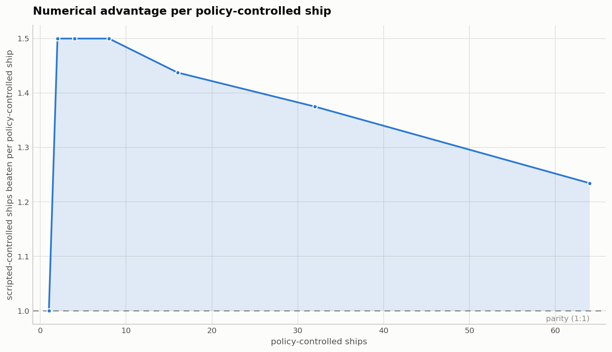
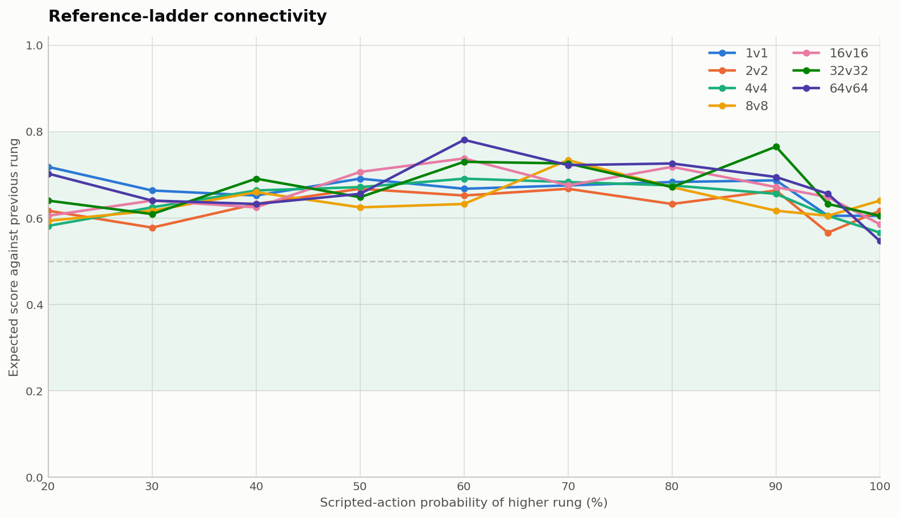
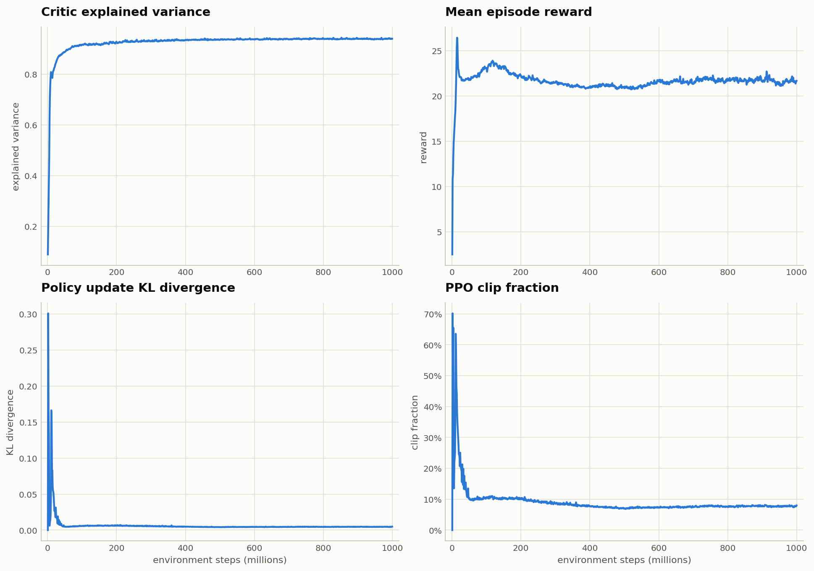

# Evaluation and results

The central result is zero-shot transfer across team size: a policy trained in 4-vs-4
combat remains effective without retraining as the learned fleet grows from one to 64
ships. Crossover against the scripted controller provides the quantitative view; seeded
replays show what that transfer looks like in motion.

This page distinguishes stored measurements from interpretations and describes the raw
artifacts behind every headline number. Known gaps are collected in
[remaining limitations](#remaining-limitations).

## Reference run and provenance

All headline figures refer to `good-leaf-719` (`7bxrz3l2`). Its preserved artifacts
include:

- [W&B export](../checkpoints/good-leaf-719/artifacts/wandb-export/): training
  configuration, sampled metric history, and final summary;
- [raw live match history](../checkpoints/good-leaf-719/elo_history.jsonl);
- [crossover sweep](crossover/crossover.json);
- [curated seeded replays](results/replays/).

Every figure on this page is rendered from a stored artifact under
[`checkpoints/good-leaf-719/artifacts/`](../checkpoints/good-leaf-719/artifacts/).
Each artifact records the command that produced it, its seeds, resolved settings,
checkpoint hashes, and the commit it was run from.
[`docs/results/provenance.md`](results/provenance.md), generated by `bnb publish`, maps
each figure to the exact artifact behind it. Earlier runs are summarised in
[training runs](training-runs.md).

The run targeted one billion environment steps and logged 999,309,312 of them over 1,004
updates, in 102.6 hours on a single RTX 4070 Laptop — about 2,700 environment steps/s, or
21,600 ship-tokens/s at 8 ships per environment. Ship-tokens/s is the primary throughput
measure here because it stays comparable when ships-per-environment changes; steps/s does
not. Two caveats on that figure: the run carried full gradient diagnostics throughout,
which are not free, and its four refractive fields add entity tokens the network attends
over. Neither is a property of the trained policy.

## Zero-shot crossover


*The learned fleet's 50% crossover stays above equal numbers throughout the displayed
1-to-64 range.*

[`crossover.py`](../src/boost_and_broadside/modes/crossover.py) fixes the learned policy to
team 0 and the stochastic scripted controller to team 1. For each learned-team size `T`,
it searches increasing scripted-team counts `S` and records:

- `beats_up_to`: the largest `S` with learned-team win rate at least 50%;
- `crossover`: the first adjacent `S` below 50%;
- the measured rates at those points and every search probe.

Ties count against the learned team. The plot draws the visual boundary halfway between
the two adjacent integer counts; it is not a continuous fitted threshold.

The same checkpoint is loaded once and evaluated across the grid. At each matchup, the
runtime ship-token count changes but no policy weight is updated. The stored sweep covers
every learned-team size from 1 through 64.

Selected measurements:

| Policy-controlled ships | Largest scripted team still beaten | Win rate there | First below 50% | Win rate there |
|---:|---:|---:|---:|---:|
| 4 | 5 | 82.4% | 6 | 39.5% |
| 8 | 11 | 72.7% | 12 | 48.4% |
| 16 | 24 | 56.6% | 25 | 41.8% |
| 32 | 48 | 56.2% | 49 | 44.1% |
| 64 | 88 | 50.3% | 89 | 49.4% |

This supports an empirical claim: the 4-vs-4-trained controller remains effective without
retraining at much larger and asymmetric sizes, and the recorded crossover stays above
numerical parity. It does **not** by itself establish a universal scale-invariance law.
The scripted controller is one opponent family, individual boundary rates carry binomial
sampling noise, and the search assumes a locally monotone boundary.

Every point stores its own win/loss/tie counts and mean episode length. Most cells are 256
parallel games; the largest matchups run fewer, because the collision tensor grows with the
square of the total ship count and the batch is shrunk to fit. The 64-ship boundary above
rests on 173 games at 88 scripted ships, a 50.3% rate with a binomial standard error near
3.8 points. Read it as roughly parity around 88, not as a threshold located to the ship.



The ratio view describes where the measured numerical advantage is larger. Its shape is
descriptive: no ablation separates coordination, per-ship tactical skill, and weaknesses
of the scripted controller.

## Qualitative crossover evidence


Outnumbered 11 ships to 8, the learned fleet wins with three ships to spare. See
[replays](replays.md) for larger battles and capture details. A clip is one qualitative
realization, not the source of the aggregate rates above.

## Post-hoc Elo calibration


*Tournament-rated checkpoints (dots, ±1 SE) sit on the refit curve; the final dot pins
the endpoint.*

Every rating on this page is calibrated Elo. Training keeps a separate *live* Elo for
opponent sampling and progress reporting; it drifts with sequential K-factor updates and
changing opponents, so it is never quoted as a result. The
[training guide](training.md#live-elo-versus-calibrated-elo) sets the two scales side by
side. [`elo_calibrate.py`](../src/boost_and_broadside/modes/elo_calibrate.py) constructs
the reported scale post hoc in two stages:

1. run an adaptive tournament among stationary players (random, the scripted controller,
   semi-random rungs between them, the frozen ladder checkpoints, and the final
   checkpoint) until every fitted rating reaches the target uncertainty;
2. refit each historical live policy from that update's saved win/loss/tie record against
   the now-calibrated opponents.

The rungs (the same mixture controllers as the
[reference ladder](#reference-ladder-conditioning) below) give the random baseline
informative matchups instead of one near-certain link, and the final checkpoint plays so
the curve's endpoint carries a full tournament rating rather than only the last update's
live record. The stored tournament converged to its ±10 target in 10 adaptive batches
and 163,840 games.

The fit uses [Bradley-Terry](https://doi.org/10.2307/2334029) expected scores. The
primary convention treats a draw as half a win for each side; a decisive-games-only fit
is retained as a diagnostic. Ratings are reported with the scripted controller fixed at
1000, matching the fleet-scale view below. A gap of 400 points corresponds to ten-to-one
odds.

Key values from the
[calibration artifact](../checkpoints/good-leaf-719/artifacts/elo-calibration/):

| Measurement | Elo | Conditional SE | Games |
|---|---:|---:|---:|
| Final checkpoint, 999.309M steps | 1748.4 | 9.8 | 7,569 tournament games |
| Best-by-live-rating checkpoint | 1732.2 | 9.7 | 7,781 tournament games |
| Best averaged policy | 1708.5 | 9.5 | 8,075 tournament games |
| Final live policy (refit), 999.309M steps | 1718.3 | 17.3 | 1,172 recorded games |
| Last frozen ladder checkpoint, 256.795M steps | 1584.1 | 8.8 | 9,771 tournament games |
| Scripted controller | 1000 (anchor) | 5.7 | 9,633 tournament games |
| Random baseline | 137.5 | 8.5 | 7,018 tournament games |

The anchor and the reference player are different here: ratings are shifted so the
scripted controller reads 1000, while errors are conditioned on `semi_scripted_0p8`, the
rung the fit was best determined against. The anchor shift carries ±5.7 in common across
every rating, which cancels whenever two of them are compared.

The final checkpoint's lead over scripted is about 748 points, and it is the strongest of
the three saved endpoints — the best-by-live-rating checkpoint sits 16 points below it,
which is what selecting on a noisy online gauge costs. The independent
[fleet-scale tournament](#symmetric-fleet-scale-ratings) below rates the same checkpoint
1765.1 ± 8.7 in its own 4-vs-4 bracket, agreeing within uncertainty.

The rungs matter more than they look: they are what keeps random connected to the field
by anything other than near-certain games, and saturated matchups carry almost no rating
information.

The compact plot above carries ±1 SE bars on the checkpoint dots but omits the refit
curve's own band. The calibration artifact stores the full win/tie matrices, the per-batch
convergence record, and both tie conventions, so the diagnostics can be redrawn without
replaying a game.

## Symmetric fleet-scale ratings

The frozen training ladder and final checkpoint were replayed in symmetric battles from
1-vs-1 through 64-vs-64. Each size has its own stationary tournament containing random,
scripted, the frozen ladder checkpoints, and the final checkpoint. The evaluator swaps
team roles and stores directed win/loss/tie counts in the
[fleet-scale artifact](../checkpoints/good-leaf-719/artifacts/elo-scale/).

Ratings again fix the scripted controller at 1000. The plotted quantity is therefore the
checkpoint's advantage over a consistent opponent, directly comparable with the calibrated
training curve above.


*The 4-vs-4 checkpoint strengthens as the fleet grows zero-shot, peaking around 32-vs-32
in this evaluation before falling back at 64-vs-64.*

| Ships per team | Tournament games | Final checkpoint Elo (±1 conditional SE) | Reached ±10 target |
|---:|---:|---:|---|
| 1 | 32,768 | 1426 ± 9 | yes |
| 2 | 49,152 | 1565 ± 9 | yes |
| 4 | 65,536 | 1765 ± 9 | yes |
| 8 | 78,125 | 2000 ± 10 | yes |
| 16 | 46,872 | 2160 ± 15 | no |
| 32 | 11,712 | 2204 ± 33 | no |
| 64 | 2,928 | 1761 ± 51 | no |

At the native 4-vs-4 scale this tournament rates the final checkpoint 1765 ± 9,
consistent with the calibration tournament's independent 1748.4 ± 9.8 above — two fits
with different fields and different reference players, agreeing inside their error bars.

Each size gets the same budget of at most twelve adaptive batches, and each batch is
shrunk to fit the collision-memory limit, so a 64-vs-64 batch is 244 games where a 4-vs-4
batch is 16,384. The three largest sizes spent that budget without reaching the ±10 Elo
target and stop where they are, so their error bars are wide, and 16 and 32 do not
separate cleanly from one another.

The fall at 64-vs-64 is not noise, despite the ±51. The
[crossover sweep](#zero-shot-crossover) measures the same width independently with
converged win rates and turns down in the same place: the policy takes 99.2% of equal-count
games at 32-vs-32 and 95.1% at 64-vs-64, and its numerical advantage falls from 1.41x to
1.25x. Both measurements agree that something gives out at the largest width tested — a
policy trained at 4-vs-4 that still wins 95% of equal fights sixteen times wider.

### Reference-ladder conditioning

Random play is extremely far from scripted play, making a direct random-to-scripted
link statistically inefficient; both the fleet-scale tournaments and the training-curve
calibration therefore add intermediate controllers. For each ship on each simulation
step, a controller with probability `P` uses the complete scripted action; otherwise it
samples a complete action uniformly at random. The refined ladder uses
`P = 0, 20, 30, 40, 50, 60, 70, 80, 90, 95, 100%`.



*Across 70 adjacent comparisons over seven fleet sizes, the stronger rung scores between
53.1% and 84.4% against its neighbor. No pair approaches a deterministic matchup.*

The saved
[reference tournament](../checkpoints/good-leaf-719/artifacts/semi-random-ladder/)
contains 128 side-balanced games for every unordered pair at every scale. Its outcome
matrices are joined to the checkpoint tournament through the shared random and scripted
endpoints before fitting, which improves graph connectivity without treating an
interpolated controller as a trained checkpoint.

The same measurement checks training's live gauge, which assigns each rung 1000·p instead
of fitting it. Every scale carries a `live_gauge_error`: the fitted ladder regauged to the
same two endpoints, minus the rating training uses. At 4-vs-4 the linear placement runs
about 110 Elo high at the `p=0.2` rung and comes within 17 points from `p=0.6` up. That is
the approximation the
[live Elo contract](training.md#live-elo-versus-calibrated-elo) was accepted on.

## Scripted benchmark over training


Across the 999 sampled history points with this metric, the policy first reaches 95% at
127.9M environment steps and 99% at 221.9M; the final point is 100%. The series is not
monotone, with a minimum sampled value after 200M of 89%, so it is best read as a
benchmark becoming a weak discriminator rather than permanent saturation at a precise
step.

The calibrated Elo continues to improve after the scripted curve becomes less informative.
That is consistent with continued learning from self-play and league opponents, but it
does not isolate which mechanism caused the improvement.

## Auxiliary dynamics learning


The auxiliary head's normalized errors fall strongly for predictable dynamics channels.
For example, position-x falls from 1.49 at the first sampled update to 0.0015 at the
last; velocity-x from 3.04 to 0.019; power from 1.47 to 0.019. Health changes much less,
from 0.57 to 0.49.

These are direct measurements from the archived W&B history. A plausible reading is that
health is dominated by sparse, hard-to-forecast damage events, but that is an
interpretation and no ablation isolates the cause. Deeper sequence behavior is in
the [autoregressive reports](ar_report/) and [noise calibration](noise_calibration/).

## Training health



The final aggregate critic explained variance is 0.939, with a sampled maximum of 0.943.
The panel also shows reward, KL, and clip-fraction trajectories. These are optimization
diagnostics rather than headline task-performance measures.

## Reproduce the figures

Every canonical figure is rendered by `bnb publish` from the artifact that
[`docs/publications.toml`](publications.toml) selects for it:

```bash
uv run bnb publish              # render every selected publication
uv run bnb publish --target elo_curve
uv run bnb publish --check      # render into a temporary tree and compare
```

Publication is offline and runs no simulation, so it needs no GPU. It verifies each source
artifact's hashes before rendering and refuses one produced from a dirty checkout or from a
measurement that never finished. `--check` reports what would change without touching
`docs/`. The renderer is the source of the axis labels and equal-scale geometry; the
tracked rasters are regenerated from it rather than edited independently.

Refitting a stored calibration also needs no GPU:
`uv run bnb elo-calibrate --from-artifact <artifact directory>` refits the saved win/tie
matrices and writes a new artifact. Rerunning the measurements themselves does need one;
see [getting started](getting-started.md#evaluate).

The curated replays are the one class of output publication does not compute. A clip is
captured as scratch under `out/`, and the manifest pins it by sha256. Where the scratch
clip is gone, `--check` verifies the tracked GIF against that committed hash instead, so a
published clip is provably the file that was reviewed.

## Remaining limitations

- The 16-, 32-, and 64-vs-64 checkpoint ratings did not reach the ±10 Elo target within
  their batch budget and carry ±17, ±37, and ±59; the largest fleets are measured from far
  fewer games than the smaller ones.
- The crossover boundary at the largest sizes rests on fewer than 256 games per point, so
  each boundary carries several points of binomial noise.
- The measurements were taken with the current environment, which has changed since the
  run was trained. They are close to the run's original evaluation but not identical to
  it: ratings differ by a few tens of Elo and crossover boundaries by at most two ships.
- Results come from one training run against one scripted opponent family; there is no
  multi-run seed study.
- The transfer results demonstrate execution and performance across observed sizes, not
  invariance under arbitrary maps, physics, observation changes, or unbounded team size.
- No causal ablation assigns the observed transfer to attention, recurrence, auxiliary
  prediction, reward decomposition, or league play individually.
