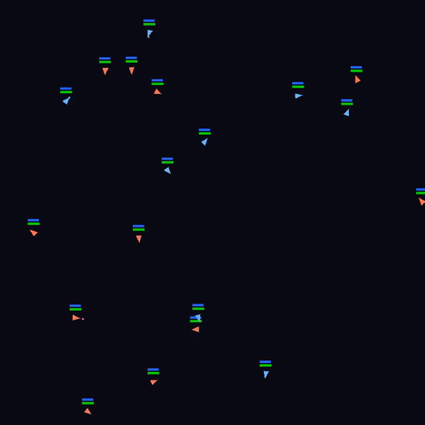
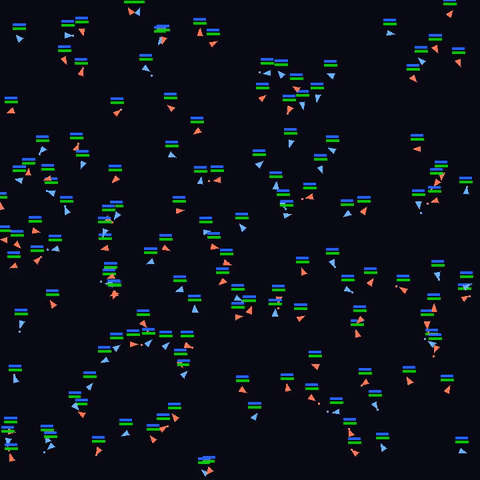

# Replays and qualitative results

These clips complement the aggregate results with examples of tactics at different fleet
sizes. In every `vs_scripted` replay, the learned fleet is blue and the scripted fleet is
red.

## Primary replay: 8 learned vs 11 scripted



The learned fleet starts three ships down and finishes with three ships to spare. The
matchup is compact and easy to follow, which is why it serves as the README hero.

The quantitative sweep reports a 69.5% learned-team win rate at this 8-vs-11 matchup and
42.2% at 8-vs-12; see [zero-shot crossover](evaluation.md#zero-shot-crossover) for the
raw data and statistical caveats. A clip is one qualitative realization, not the source
of those aggregate rates.

## Large-scale transfer: 64 vs 80



The same variable-cardinality execution path at a much larger scale. The stored crossover
sweep reports a 91.1% learned-team win rate at 64-vs-80, while the empirical boundary is
between 87 and 88 scripted ships.

## Self-play

[View the 8-vs-8 self-play clip](results/replays/self_8v8_seed01.gif).

In self-play, both sides use the same weights. Team 1 receives a team-flipped observation
because the `ego_pass` policy is canonicalized to the team-0 perspective. Self-play
footage shows execution symmetry; it is not independent benchmark evidence. Additional
self-play clips at 2, 4, 16, 32, and 64 ships per side are in
[`docs/results/replays/`](results/replays/).

## Other asymmetric clips

- [4 learned vs 5 scripted, seed 00](results/replays/vs_scripted_4v5_seed00.gif)
  and [seed 04](results/replays/vs_scripted_4v5_seed04.gif) show qualitative variability
  near the native training scale.
- [16 vs 22, seed 02](results/replays/vs_scripted_16v22_seed02.gif) is an intermediate
  scale.
- [32 vs 44, seed 04](results/replays/vs_scripted_32v44_seed04.gif) is another asymmetric
  matchup near, but below, that size's measured crossover.

## How capture works

[`capture.py`](../src/boost_and_broadside/modes/capture.py):

- loads the final `step_*.pt` checkpoint from the selected run;
- accepts symmetric or asymmetric team-size specifications;
- seeds PyTorch and the environment for each match;
- writes an MP4 by piping rendered RGB frames to `ffmpeg`;
- optionally creates a palette-optimized, downscaled GIF;
- records the terminal winner in console output and holds the terminal state on screen.

For self-play, team 1 uses a second recurrent state and team-flipped observation but shares
the policy weights. For `vs_scripted`, team 1 actions come from the stochastic scripted
controller.

Generate the selected 8-vs-11 scenario with:

```bash
uv run main.py --mode capture \
  --run resilient-resonance-682 \
  --scenarios vs_scripted \
  --sizes 8v11 \
  --seeds 3 \
  --gif
```

The default output directory is `gameplay_clips/`; the curated subset is copied into
`docs/results/replays/`.

## Provenance

The current GIFs encode frames only — not the run, checkpoint hash, source commit,
capture arguments, or winner. Controller colors and the hero clip's terminal outcome
have been verified against the capture code and the frames themselves; exact checkpoint
provenance cannot be reconstructed from a GIF alone. Future curated captures should
carry a JSON sidecar and a poster frame, which is tracked with the other known gaps in
the [internal evidence ledger](internal/evidence.md#deferred-asset-and-analysis-ledger).
